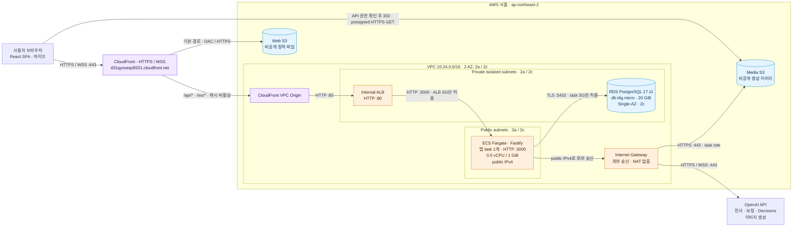
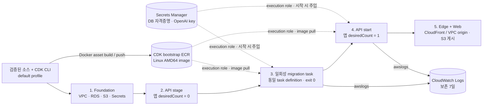

# 현재 AWS 인프라 아키텍처

2026-10-09 16:22 KST 배포·검증 기준이다. 서비스 주소는 **https://d31qyxseqz8321.cloudfront.net**이며, AWS 계정 `004376454721`의 서울 리전(`ap-northeast-2`)에 배포했다. 선언 코드는 [CDK stacks](../../infra/src/stacks.ts), 실행 근거는 [G4 릴리스 기록](../implementation/evidence/release.md)에 있다.

확대·공유용 SVG: [서비스 인프라](aws-runtime.svg), [배포 흐름](aws-deployment.svg). 아래 Mermaid 원본에서 렌더링했다.

## 서비스 요청과 데이터 경로

두 AZ에 서브넷을 만들었지만 앱 task는 전체 서비스에서 **한 개**, RDS도 **Single-AZ**다. 다중 AZ 애플리케이션 가용성을 제공하는 구성은 아니다. Fargate의 public IPv4는 OpenAI와 AWS 공개 서비스 endpoint에 나가기 위한 것이며, task 인바운드는 ALB 보안 그룹의 3000번 포트만 허용한다. 내부 ALB와 RDS에는 public IP가 없다. VPC endpoint와 NAT Gateway는 구성하지 않았다.

| 경로 | 처리·보호 방식 |
| --- | --- |
| 정적 웹 | CloudFront → S3 OAC. 기본 behavior의 Function이 알려진 SPA 경로만 `index.html`로 변환. `index.html`은 `no-cache`, 해시 asset은 `immutable`. |
| API·WebSocket | CloudFront → VPC origin → 내부 ALB → Fargate. 캐시 비활성, Host·Origin·쿠키·query 전달. `/ws/events`, `/ws/audio`를 같은 HTTPS origin에서 연결. |
| 이미지 열기 | API에서 접근 권한 확인 → `no-store` 302 → 브라우저가 S3 presigned URL로 실제 bytes 조회. Media bucket은 공개하지 않음. |
| DB | task → RDS PostgreSQL 5432. `verify-full` TLS와 RDS CA bundle 사용. 사용자·세션·경험·스터디·개인 기록 보관. |
| 보안 그룹 | ALB :80은 CloudFront managed prefix list `pl-22a6434b`, task :3000은 ALB SG, DB :5432는 task SG만 수신. |
| 상태 검사 | ALB target `/healthz`, ECS container `/readyz`. ALB idle timeout·CloudFront origin read timeout 모두 120초. |

## 이미지·비밀값·로그와 배포 순서

점선은 task 시작 시 이미지·비밀값을 가져오는 의존 관계다. ECS **execution role**이 이미지 pull·secret 조회·로그 전송을 맡고, 앱 **task role**은 Media S3 object의 Get/Put/Delete 권한을 가진다. 비밀값은 코드·브라우저 bundle·배포 인수에 넣지 않는다.

앱 배포는 `minimumHealthyPercent=0`, `maximumPercent=100`으로 기존 task를 내린 뒤 교체한다. 따라서 교체 중 짧은 중단과 WebSocket 재연결이 발생할 수 있다. 자동 확장은 없고, circuit breaker는 실패한 배포를 중단하며 자동 rollback은 하지 않는다. DB·S3·Secrets는 삭제 시 보존하며 Foundation termination protection과 RDS deletion protection을 켰다.

## 실제 배포 리소스

| 리소스 | 배포 값 |
| --- | --- |
| CloudFormation | `StudyFoundationStack`, `StudyApiStack`, `StudyEdgeStack` |
| CloudFront distribution | `E1UWQHZZY8UP44` |
| VPC origin | `vo_Cj60rIGbAcQGI1HVJF3gEZ` |
| VPC | `vpc-0e1b7a09702e8b34b` |
| Public subnets | `subnet-0dda1bd8f9a82469a`, `subnet-065afc34f9e7fb716` |
| Private isolated subnets | `subnet-0dec891d56f5a37c4`, `subnet-0d95ea8376faae909` |
| ALB | `StudyA-Alb16-HgSeJhRNxOnn` |
| ECS cluster | `StudyApiStack-ClusterEB0386A7-5DDeWJbIf145` |
| ECS service | `StudyApiStack-ServiceD69D759B-DpxYtWISPJmI` |
| Task definition | `StudyApiStackTask96185A21:1` |
| RDS instance | `studyfoundationstack-databaseb269d8bb-zsniaurzmxtn` |
| Web bucket | `studyfoundationstack-webbucket12880f5b-yt4rwc101kus` |
| Media bucket | `studyfoundationstack-mediabucketbcbb02ba-buzj9yp32o3x` |
| Log group | `StudyApiStack-ApiLogs3D05D88B-EzLxGclRElPQ` |

배포 image digest는 `sha256:c5490ea9ed6e40c85b520eb3af95bc8a0f1d44018b14d966701da491351152e1`이다. 배포 소스는 `35290d3` 기반의 검증된 G4 snapshot이며 이후 `8343973`의 랜딩 페이지 변경은 이 배포에 포함되지 않았다. 정확한 소스 지문·lockfile 지문은 [검증 기록](../implementation/evidence/local-validation.json)에 남겼다.

HTTPS·쿠키·캐시·두 WebSocket upgrade, 실제 OpenAI·RDS·S3 연결, ECS task 교체 후 데이터 재조회는 통과했다. **AWS URL에서 두 물리 노트북·실마이크로 수행하는 G4 인수 결과는 아직 미확인**이다. 자세한 범위와 증거는 [릴리스 기록](../implementation/evidence/release.md)을 따른다.
