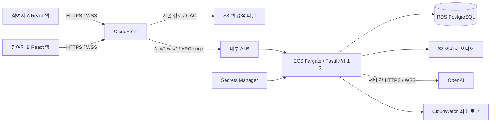
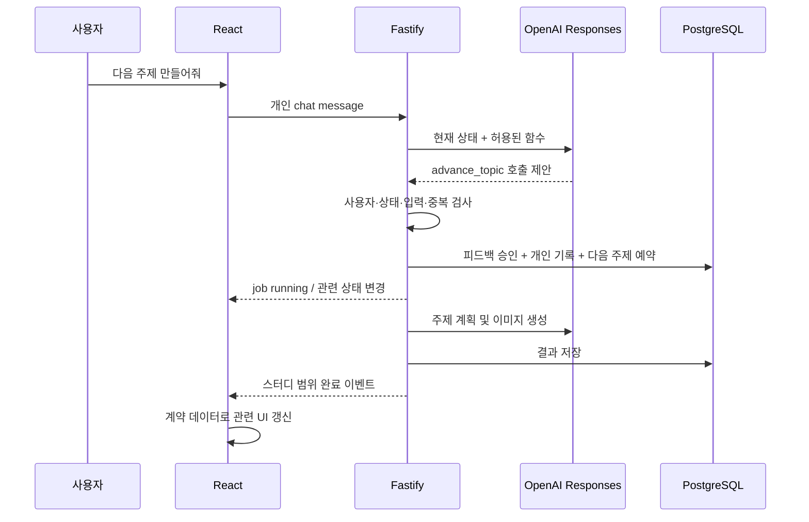

# MVP 아키텍처와 기술 스택 선정

상태: 구현 기준 선정 완료 · 계정별 실행 검증은 후속 작업. 확인일: 2026-10-09.

## 1. 기준과 선정 이유

[PRD](../prd.md)의 세 주요 화면과 핵심 기능을 모두 구현한다. 같은 공간의 참여자들이 각자 노트북을 사용하며, 각 마이크에는 본인 음성만 들어온다는 사용자 지정 전제를 그대로 적용한다. 서비스 내 통화, 음성 화자 분리, 프로덕션 운영 정책은 추가하지 않는다.

React 프론트엔드와 TypeScript 단일 서버를 독립된 앱으로 두고, 공유 스키마를 별도 패키지로 관리한다. 지속적인 음성 연결과 두 기기의 상태 전파를 하나의 서버 프로세스에서 처리해 초기 구현 경로를 줄인다. 데이터 저장과 최종 승인에는 PostgreSQL 트랜잭션을 사용한다. UI 배치나 컴포넌트 이름은 API 및 AI 도구에 포함하지 않는다.

빠른 구현의 기준은 서버 수보다 구현해야 할 독립 실행 흐름의 수다. 음성 릴레이, 일반 API, AI 작업 실행기를 하나의 앱에 둔다. 별도 메시지 브로커, 분산 작업 큐, 에이전트 프레임워크, 검색용 벡터 DB는 필요하지 않다. 사용자 가입과 개인 데이터 구분에 필요한 최소 식별 기능은 유지한다.

## 2. 전체 구성

위 그림은 최종 AWS 배포 구성이다. 구현은 로컬 Fastify·Docker PostgreSQL·파일 저장 adapter로 시작하고, 실제 OpenAI와 두 노트북으로 전체 기능을 검증한 뒤 AWS에 배포한다. HTTP·WS·도메인 계약은 그대로 유지한다. 인프라 코드 작성·synth는 병렬로 진행하되 AWS 리소스 생성은 G3 통과 이후다. [로컬 실행서](../implementation/local-validation.md)

CloudFront 기본 도메인을 사용해 별도 도메인 구매 없이 HTTPS/WSS와 마이크 접근을 제공한다. API는 VPC origin을 통해 내부 ALB에 연결한다. 현재 AWS 문서에서 서울 리전 VPC origin 지원 및 WebSocket 지원을 확인했다. 초기 VPC origin 생성에는 최대 15분이 걸릴 수 있으므로 G3 이후 배포 시간에 반영한다. [VPC origin 문서](https://docs.aws.amazon.com/AmazonCloudFront/latest/DeveloperGuide/private-content-vpc-origins.html), [WebSocket 구성 예시](https://aws.amazon.com/blogs/networking-and-content-delivery/private-ai-agent-with-websocket-streaming-over-cloudfront-vpc-origins-and-the-next-generation-of-opensearch-serverless-for-knowledge-retrieval/)

## 3. 기술 스택

| 영역 | 선정 | MVP에서 맡을 일 |
| --- | --- | --- |
| 저장소 | pnpm workspace | `apps/web`, `apps/api`, 공유 패키지, `infra` |
| 언어·런타임 | TypeScript strict, Node.js 24 LTS | 프론트·서버·인프라의 언어 통일 |
| 프론트 | React, Vite, React Router | 세 주요 화면과 가입·스터디 생성·초대 진입 |
| UI | SEED Design v3 React/CSS/CLI 스니펫, CSS Modules | 실제 SEED 컴포넌트 사용, 로컬 디자인 토큰 적용 |
| 서버 상태 | TanStack Query | 조회·명령 결과·이벤트 반영. 쿼리/변경 자동 재시도는 끔 |
| 화면 상태 | React state/context | 토글, 패널, 입력 중 문장, 로컬 내비게이션 |
| API·실시간 | Fastify, `@fastify/websocket`, `ws` | JSON HTTP, 사용자/스터디 이벤트, 음성 릴레이 |
| 공유 계약 | Zod 4 스키마 + 추론 TypeScript 타입 | 요청·응답·이벤트·도구 입력의 실행 시 검증 |
| 영속 데이터 | PostgreSQL 17, Drizzle ORM와 SQL migration | 사용자, 스터디, 전사, 피드백, 학습 기록과 원자적 승인 |
| AI | 공식 OpenAI JavaScript SDK + Realtime WebSocket | 전사·보정·학습·경험 정리·주제·이미지 |
| 파일 저장 | 공통 MediaStore, 로컬 파일 / AWS S3 adapter | 생성 이미지와 보정용 WAV의 실제 저장·읽기. FE 경로는 동일 |
| 인프라 | AWS CDK v2 TypeScript | 재현 가능한 AWS 구성 |
| 검증 | Vitest, MSW, Playwright | 핵심 상태 전이·계약·두 사용자 흐름. 실마이크 수동 검증 병행 |

Node.js 24의 LTS 상태, Fastify WebSocket 플러그인, Zod의 JSON Schema 변환과 Drizzle 트랜잭션 지원을 공식 자료에서 확인했다. 정확한 패치 버전은 S0가 호환 빌드 후 lockfile에 고정하며, 작업 세션별로 `latest`를 따로 설치하지 않는다. [Node.js](https://nodejs.org/en/about/previous-releases), [Fastify WebSocket](https://github.com/fastify/fastify-websocket), [Zod](https://zod.dev/json-schema), [Drizzle](https://orm.drizzle.team/docs/transactions)

## 4. 대안 검토

| 결정 | 대안 | 선정 근거와 부담 |
| --- | --- | --- |
| Vite SPA | Next.js 전체 스택 | SEO·SSR 요구가 없고 실시간 스터디가 중심이다. 정적 웹을 독립 배포하고 장기 연결은 서버가 맡는다 |
| Fastify/TypeScript | Python FastAPI | 둘 다 가능하나 이번에는 TypeScript 계약·검증 코드와 도구 타입을 함께 쓰는 이점이 크다 |
| 단일 Fargate 앱 | Lambda + API Gateway + 별도 음성 경로 | 함수 기반 구성도 가능하나 지속적인 OpenAI 음성 연결·작업 상태·팬아웃을 여러 서비스로 나누는 구현 부담이 생긴다 |
| Fargate | EC2 한 대 + Docker Compose | EC2는 리소스 비용과 구성 개수가 적을 수 있다. Fargate는 VM 관리 없이 앱 컨테이너를 실행하고 DB를 분리할 수 있다. 대신 ALB·RDS 고정 비용과 CDK 초기 작업을 감수한다 |
| 일반 ECS 서비스 | ECS Express Mode | Express Mode의 기본 HTTPS 진입점은 편리하지만 기본 자동 확장·canary 배포를 본 설계의 단일 프로세스 제약에 맞게 바꿔야 한다. 명시적인 단일 태스크 구성을 선택한다 |
| PostgreSQL | DynamoDB | 발화자별 학습 저장, 피드백 revision 검증, 다음 주제 예약을 하나의 트랜잭션으로 설명하기 쉽다. DynamoDB의 키·조건부 쓰기 설계는 이번 속도 이점이 작다 |
| WebSocket | 주기적 조회 / SSE + 별도 오디오 | 양방향 음성과 이벤트를 같은 서버 기술로 다룬다. 부분 전사와 초대도 즉시 전파한다 |
| 직접 함수 호출 | 런타임 MCP / Agents SDK | 현재 제품 내부의 제한된 기능만 실행한다. 별도 프로토콜 서버나 에이전트 오케스트레이션 계층이 없어도 충분하다 |

이는 요구사항을 바탕으로 한 설계 판단이며 벤치마크 결과는 아니다. ECS Express Mode의 기본 리소스·배포 방식은 [AWS 공식 설명](https://aws.amazon.com/blogs/containers/extending-amazon-ecs-express-mode-to-build-an-optimal-container-environment/)을 확인했다.

## 5. OpenAI 모델과 호출 경로

모든 AI 모델은 OpenAI에서 제공하는 모델을 사용한다. VAD는 오디오 에너지와 무음 길이를 계산하는 신호 처리이며 별도 AI 모델을 사용하지 않는다.

| 역할 | 초기 모델 ID | API와 설정 방향 |
| --- | --- | --- |
| 실시간 원문 전사 | `gpt-live-transcribe` | Realtime transcription, 24 kHz PCM16 mono, `languages: ["ko", "en"]`, `delay: "low"`, 클라이언트 VAD로 commit |
| 인식 오류 보정 | `gpt-transcribe` | 같은 발화 WAV를 Audio Transcriptions에 다시 입력. 원래 언어·틀린 문법을 보존하고 상황·고유명사 힌트를 제공 |
| 개인 챗봇·도구 선택 | `gpt-6-luna` | Responses API, strict function calling, 초기 reasoning effort `low` |
| 피드백·경험 정리·주제 계획 | `gpt-6-luna` | Responses API Structured Outputs, 기능별 별도 스키마·프롬프트 |
| 상황 이미지 | `gpt-image-2.5-flare-2026-09-08` | Image API, 한 주제당 1장, 초기 quality `low`, size `1024x1024` |

공식 문서가 현재 권장하는 실시간/파일 전사 경로를 채택했다. `gpt-live-transcribe`는 `server_vad`를 지원하지 않으므로 클라이언트 VAD를 사용하며, 완료 이벤트가 발화 순서대로 도착한다고 가정하지 않는다. [실시간 전사](https://developers.openai.com/api/docs/guides/realtime-transcription), [파일 전사](https://developers.openai.com/api/docs/guides/speech-to-text)

Luna의 함수 호출·구조화 출력 지원과 Flare의 Image API 지원을 확인했다. 모델 이름은 서버 환경변수로 주입하고 FE 계약에 노출하지 않는다. 계정별 접근·쿼터와 실제 한국어/영어 혼용 품질은 아직 검증하지 않았다. S2가 G1에서 실제 호출로 확인하며, 문제가 있으면 OpenAI 내 대체 모델을 검증하고 선정 기록을 갱신한다. 실패를 더미 결과나 이미지 없는 성공으로 바꾸지 않는다. [Luna](https://developers.openai.com/api/docs/models/gpt-6-luna), [Flare](https://developers.openai.com/api/docs/models/gpt-image-2.5-flare), [이미지 API](https://developers.openai.com/api/docs/guides/image-generation)

### 음성과 피드백의 분리

1. 대화 중 각 브라우저가 마이크를 계속 확보하고 AudioWorklet으로 PCM을 만든다. 참여자 식별은 인증된 입력 연결에서 정한다.
2. 브라우저의 발화 구간별 오디오를 서버가 OpenAI로 전달한다. 부분 전사는 임시 표시, 완료 전사는 변경하지 않는 `rawText`로 저장한다.
3. 동일 오디오의 두 번째 전사 결과를 `correctedText`로 저장하고 원문 아래에 표시한다. 텍스트만 보고 실제 발화를 추측하는 보정으로 대체하지 않는다.
4. 틀린 영어를 고치거나 한국어를 영어로 번역하는 일은 이 단계에서 하지 않는다. 음성 재전사도 항상 더 정확하지는 않으므로 사람이 비교·편집할 수 있어야 한다.
5. 사람이 주제를 끝내면 남은 발화·보정 처리를 마친 뒤 문장별 학습 피드백을 생성한다. 수정 후 재요청은 그 문장의 최신 보정 revision만 대상으로 한다.

발화 20초 분할, 무음 기준 등의 수치는 초기 처리 설정이다. 사람의 대화 시간이나 발언 순서를 제한하는 제품 기능이 아니다. 상세 프로토콜과 종료 시 처리 순서는 [공유 계약](../implementation/shared-contracts.md)에 있다.

## 6. 개인 챗봇, 제품 기능, UI의 연결

API 서버가 실행 권한과 현재 상태를 판단한다. 모델은 함수 호출을 제안할 뿐 DB를 직접 수정하거나 React 코드를 생성·실행하지 않는다. 버튼도 동일한 도메인 명령을 호출한다. 완료 전에는 ‘생성 중’, 실패하면 ‘실패’를 표시한다. 챗봇의 문장만으로 성공 여부를 판정하지 않는다. 함수 호출은 애플리케이션이 실행하고 결과를 모델에 돌려주는 흐름이다. [OpenAI 함수 호출](https://developers.openai.com/api/docs/guides/function-calling)

### MCP 결론

MCP는 이번 제품 런타임에 필요하지 않다. 함수 호출만으로 제품 명령과 데이터 조회를 연결할 수 있고, UI 갱신은 애플리케이션 이벤트 계약이 담당한다. MCP를 도입해도 사용자 식별, 동의 검증, 중복 방지, 실시간 UI 동기화는 별도로 구현해야 한다.

여러 외부 AI 클라이언트에 같은 제품 기능을 공개해야 할 때 MCP 어댑터를 추가할 수 있다. 이 경우에도 현재 도메인 명령을 감싸며 UI 컴포넌트를 도구로 노출하지 않는다. 이 확장은 MVP 작업에 포함하지 않는다. [OpenAI MCP 지원](https://developers.openai.com/api/docs/guides/tools-connectors-mcp)

SEED Docs/Figma MCP는 개발자가 SEED 자료를 읽는 개발 보조 수단이다. 이를 제품 챗봇의 런타임 의존성과 혼동하지 않는다. 이번 프로젝트는 공식 웹 문서와 패키지만으로 적용할 수 있다. [SEED AI 도구](https://seed-design.io/ai-integration)

## 7. 디자인 자료와 SEED 적용

실제 확인한 로컬 자료는 [디자인 시스템 HTML](../../design/design-system.html)과 [토큰 CSS](../../design/tokens.css)다. HTML은 화면 완성본이 아니라 컬러·대비·타이포·아이콘 기준이다. 예시 문구에 등장하는 타이머·화자 전환·상대 판정 같은 기능은 PRD에 없는 기능 요구로 해석하지 않는다.

| 기준 | 적용 |
| --- | --- |
| 라이트 확정 / 다크 제안 | MVP 라이트 고정. SEED 플러그인 `colorMode: "light-only"` 사용 |
| 보라 주색 | `--mc-brand` → `#7F4FE6`, 눌림·약한 배경도 로컬 토큰 사용 |
| 서비스 의미색 | Honey=학습 강조, Mint=확인, Rose=동료, Violet=정보, Red=오류·녹음 |
| 서체 | UI·혼용 문장은 Pretendard. 영문·숫자 단독 제목에만 Montserrat |
| 모양 | 로컬 8/12/16px 및 pill radius |
| 아이콘 | Iconify Material Symbols, 내비게이션 20px·버튼 1.2em·단독 24px, currentColor |

SEED의 Action Button, Dialog, Text Field, Accordion, Tabs, Badge, Skeleton/Progress Circle, Snackbar를 실제로 사용한다. 스니펫을 `apps/web/seed-design/`에 두고, `shared/ui` 래퍼에서 앱 스타일을 적용한다. 서비스 전용 전사 레이어·학습 카드·주제 패널은 이 기반 위에 조합한다. 로컬 기준을 우선하고 SEED 기본 당근색·아이콘으로 일괄 교체하지 않는다.

`@seed-design/css/base.css`를 가져오고 Vite 플러그인을 구성한 뒤 로컬 토큰과 앱 스타일을 적용한다. 실제 설치 버전의 SEED recipe/공개 스타일 속성 또는 래퍼 클래스로 매핑하며 내부 DOM 선택자에 의존하지 않는다. `seed-theme.css`에 매핑을 모아 UI 수정 시 한 곳에서 바꾼다. 토큰명은 설치된 공식 CSS와 대조한다. [SEED Vite 설치](https://seed-design.io/react/getting-started/installation/vite), [테마](https://seed-design.io/react/getting-started/styling/theming), [컴포넌트](https://seed-design.io/components)

## 8. AWS 범위와 한계

서울 `ap-northeast-2`에 VPC, 내부 ALB, Fargate 앱 1개, Single-AZ RDS를 둔다. 웹/미디어 S3는 분리한다. 앱은 인터넷 송신용 public subnet과 public IP를 사용하지만 inbound는 ALB 보안 그룹에서만 받는다. ALB·RDS는 private subnet에 둔다. NAT Gateway는 만들지 않는다. [Fargate 네트워크](https://aws.amazon.com/blogs/compute/task-networking-in-aws-fargate/)

서버 내 연결 목록과 실행 중 작업은 단일 프로세스 전제다. 자동 확장을 끄고 앱 태스크가 동시에 2개가 되지 않게 배포한다. 새 버전 배포는 진행 중 스터디가 없을 때 수행한다. 무중단 배포·장애 복구·작업 이어하기는 이번 범위가 아니다. DB와 S3 데이터는 태스크 교체 후에도 남으며, 저장된 개인 학습 기록은 다시 조회할 수 있어야 한다.

Secrets Manager에는 OpenAI 키와 DB 접속 비밀을 둔다. 서버가 발급한 불투명 세션 쿠키, 데이터 소유자 검사, 참여자 검사, 기본 로그는 개인 데이터 구분과 실행에 필요한 최소 구현이다. 이메일 인증, 비밀번호 복구, 역할별 승인, WAF, 운영 대시보드, 자동 재시도, 백업 복원 정책 등은 추가하지 않는다.

Fargate·ALB·RDS는 사용자가 없어도 비용이 발생한다. OpenAI 음성 2회 처리와 이미지 호출, S3, CloudFront 전송도 비용 요인이다. 고정 월 비용을 검증하지 않았으므로 무료나 최저 비용이라고 주장하지 않는다. 후속 S5가 실제 리전·사양으로 예상 비용을 기록한다. 구현 속도와 반복 가능한 배포를 우선한 선택이다.

## 9. 검증 우선순위

1. 로컬 앱과 실제 OpenAI를 연결해 마이크의 한국어·영어 혼용 원문을 보존하고, 보정 단계가 학습용 문법 교정과 섞이지 않는지 확인한다.
2. 로컬 HTTPS/WSS에서 두 노트북의 마이크 권한·세션·동기화를 일찍 확인한다.
3. 두 사용자의 동시 다음 주제 요청이 한 번의 승인·저장·생성으로 수렴하는지 검증한다.
4. 공유 no/미응답 표현과 개인 챗봇 원문이 상대 기기로 전달되지 않는지 확인한다.
5. FE가 같은 계약 fixture를 유지한 채 화면을 재배치해도 기능이 유지되는지 확인한다.
6. 모든 로컬 기능 검증 G3를 통과한 뒤 배포하고, G4에서 CloudFront → VPC origin → ALB → 앱의 WSS와 RDS/S3 등 AWS에서만 확인할 항목을 검증한다.

실행 작업과 수용 기준은 [구현 계획](../implementation/work-plan.md), [인수 기준](../implementation/acceptance.md)에 연결한다.
