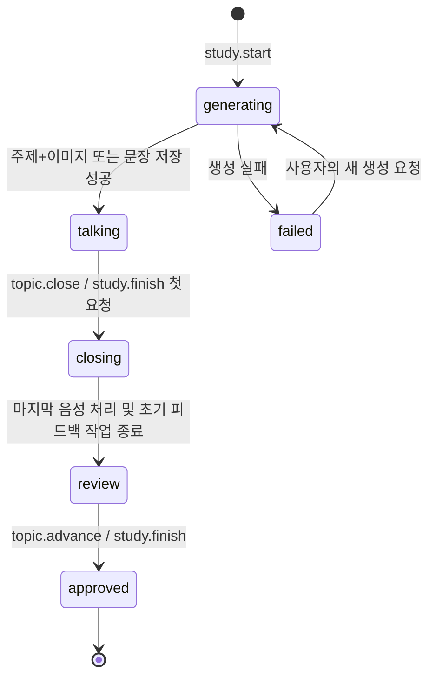

# 프론트엔드·백엔드·AI 공유 계약

계약 버전: v1 구현 기준. 기능 근거: [PRD](../prd.md), 구성 근거: [아키텍처](../architecture/mvp-architecture.md).

이 문서는 후속 S0가 실행 가능한 Zod 스키마로 옮길 규범이다. 아래 경로·타입·명령은 구현 예정이며 현재 저장소에 API가 존재한다는 뜻이 아니다. UI의 버튼 수나 배치는 계약으로 고정하지 않는다.

## 1. 계약의 단일 원본과 변경 방법

`packages/contracts/src/`가 요청·응답·이벤트·도구 입력 스키마의 단일 원본이다. `z.infer`로 TypeScript 타입을 얻고, 서버는 요청과 AI 결과를 검증한다. 클라이언트도 응답·이벤트를 검증한다. DB 테이블 타입, OpenAI SDK 응답, React props를 외부 계약으로 직접 노출하지 않는다.

S0는 각 endpoint의 method/path/input/output와 이벤트 이름을 registry로 정의한다. `packages/client`의 typed fetch와 이벤트 어댑터, `packages/fixtures`의 MSW 응답이 이 registry를 소비한다. 도구별 JSON Schema는 Zod에서 생성하되 OpenAI strict 모드의 제한을 확인한다. 선택적 도구 인수는 required nullable로 표현하고 `additionalProperties: false`를 적용한다. HTTP의 선택 필드까지 이 제약에 억지로 맞추지는 않는다.

계약 변경은 다음 순서다.

1. 요청 세션이 기능 이유와 영향을 받는 DTO/명령/fixture를 S0에 전달한다.
2. S0가 스키마·타입·fixture·본 문서를 함께 변경하고 소비 세션에 알린다.
3. S1/S2의 서버와 S3/S4의 클라이언트를 같은 변경 묶음에서 갱신하고 계약 검증을 통과시킨다.
4. 화면 배치·문구·토글·패널 크기·스타일 변경은 이 절차 없이 FE 소유 범위에서 진행한다.

코드와 문서의 의미가 달라지면 구현을 조용히 정답으로 삼지 않는다. PRD → 이번 대화의 확인 사항 → 본 계약 순서로 확인한다. v1 안에서는 기존 필드 삭제·의미 변경·enum 추가를 소비 측 검토 없이 수행하지 않는다. 별도 OpenAPI 명세를 수작업으로 중복 관리하지 않는다.

## 2. 기본 규칙과 식별

- ID는 서버 발급 UUID 문자열, 시간은 UTC ISO 8601, 날짜 표시는 FE가 처리한다.
- 변경 가능한 모든 DTO는 정수 `revision`을 가진다. 이벤트의 entityRevision은 이 값이다. Study.transitionVersion은 진행 명령 전용, Utterance.correctionRevision은 보정문/피드백 연결 전용으로 별도 유지한다.
- 사용자 공개 아이디 `handle`과 내부 `userId`를 분리한다. handle은 공백 제거와 영문 소문자 정규화 후 DB UNIQUE로 중복을 차단한다. 표시 이름 중복은 허용한다.
- 가입 성공 시 서버가 무작위 불투명 토큰을 발급하고 DB에는 토큰 해시와 userId를 연결한다. 쿠키는 HttpOnly, SameSite=Lax, Path=/를 사용한다. Secure는 로컬 LAN HTTPS와 AWS에서 켜고 단일 기기 localhost HTTP 개발에서만 끈다. 쿠키 유지로 같은 브라우저의 재조회가 가능하게 한다.
- 가입은 이름+아이디만 받는다. 알려진 아이디만 입력해 타인의 계정 세션을 발급하는 로그인은 만들지 않는다. 브라우저의 식별 정보가 사라진 뒤 계정 복구는 범위 밖이다.
- actorUserId는 항상 쿠키에서 정한다. HTTP body, WebSocket 메시지, 모델 인수의 userId로 실행 주체를 바꾸지 않는다.
- 스터디 제어 권한은 가입한 스터디 참여자 모두에게 같다. 초대받은 사용자가 `join`한 뒤 제어·공통 데이터 조회가 가능하다. 진행 중인 스터디에도 초대된 사용자가 입장할 수 있고 종료된 스터디에는 새로 입장하지 않는다.
- 경험·개인 챗봇·개인 학습 조회는 본인 범위다. 주제 생성 서버만 참여한 사용자들의 저장된 경험 요약을 읽는다. 원문 경험을 스터디 전체 응답에 넣지 않는다.

## 3. 공용 DTO

S0는 아래 필수 필드를 구체적인 Zod 스키마로 정의한다. nullable은 ‘아직 없음’, 빈 배열은 ‘결과가 없음’을 뜻하며 혼용하지 않는다.

| DTO | 필수 내용 |
| --- | --- |
| `User` | id, handle, displayName |
| `Study` | id, status=`waiting/active/ended`, currentTopicId nullable, transitionVersion, members `{userId,handle,displayName,state:invited/joined}`, createdAt, endedAt nullable |
| `Topic` | id, studyId, ordinal, state=`generating/talking/closing/review/approved/failed`, focusUserId nullable, content nullable, generationJobId, approvedAt nullable |
| `TopicContent` | kind=`image/sentence`, title, situationText, conversationInstruction, imageMediaId nullable, sentence nullable, sourceExperienceIds, learningExpressionIds, sharedExpressionIds |
| `TranscriptSegment` | id, studyId, topicId, speakerUserId, startOrder, startedAt, endedAt nullable, rawText nullable, rawStatus, correctedText nullable, correctionStatus, sentenceStatus=`pending/ready/failed` |
| `Utterance` | id, sentenceIndex, sourceRanges `[{segmentId,rawStart,rawEnd,correctedStart,correctedEnd}]`, studyId, topicId, speakerUserId, startOrder, startedAt, endedAt, rawText, correctedText, correctionStatus, correctionRevision, correctedBy=`ai/human`, updatedAt |
| `Feedback` | utteranceId, inputCorrectionRevision, status=`running/ready/stale/failed`, items `[{id,category,summary,explanation,expression,meaning,example}]`, error nullable |
| `LearningItem` | id, ownerUserId, kind=`word/expression`, expression, meaning, example, source=`approved_feedback/chat`, sourceKey, sourceStudyId nullable, sourceUtteranceId nullable, createdAt |
| `Experience` | id, ownerUserId, originalText, answers `[{question,answer}]`, summary, interests string[], context `{place,people,event,actions}` (모르는 값은 null 또는 빈 배열), updatedAt |
| `ExperienceDraft` | id, ownerUserId, originalText, answers, questions string[], summary nullable, interests, context. 질문 미응답이어도 정리 가능 |
| `ChatMessage` | id, studyId, ownerUserId, role=`user/assistant`, text, status=`running/succeeded/failed`, commandResults[], learningItemIds[], shareProposalId nullable, createdAt |
| `ShareProposal` | id, studyId, ownerUserId, learningItemId, expression, status=`pending/accepted/declined`, decidedAt nullable |
| `SharedExpression` | id, studyId, contributorUserId, expression, meaning, example, sourceProposalId |
| `Job` | id, kind, scope=`user/study`, ownerUserId nullable, studyId nullable, targetId, status=`running/succeeded/failed`, result (kind별 union) nullable, error nullable, createdAt, finishedAt nullable |

`rawStatus`와 `correctionStatus`는 `pending/running/ready/failed`다. 보정문은 raw와 별도 필드이며 같을 수도 있다. `Feedback.items=[]`와 `status=ready`는 피드백이 필요 없다는 정상 결과다. 학습용 표현은 `correctedText`를 덮어쓰지 않는다.

`TopicContent`는 kind=image일 때 imageMediaId, kind=sentence일 때 sentence를 필수로 검증한다. 양쪽 모두 conversationInstruction을 필수로 한다. 진행 지시는 토익스피킹 유형을 참고한 자체 생성 지시이며 외부 시험 문제 수집 기능은 만들지 않는다.

`StudySnapshot`은 Study, 현재 Topic, 현재 주제의 TranscriptSegment/Utterance/Feedback, SharedExpression, 스터디 범위 Job만 포함한다. 개인 챗봇·학습 목록·ShareProposal·경험 원문은 포함하지 않는다. private DTO에는 ownerUserId가 있어도 서버가 해당 소유자에게만 응답한다.

## 4. 상태 전이와 최종 승인



Study는 별도로 waiting → active → ended다. `topic.advance`는 이전 Topic을 approved로 만들면서 다음 Topic을 generating으로 예약한다. 최초 start의 사전 조건 실패 시 Study는 waiting에 남는다. 생성 API가 시작된 뒤 실패하면 현재 Topic은 failed로 남고 실패를 표시한다.

| 명령 | 허용 상태 | 결과 |
| --- | --- | --- |
| `study.start` | Study waiting | 경험·관심사 근거 검사 → 첫 Topic 예약·생성 → talking |
| `topic.close` | Topic talking | closing → 입력 마감 → 문장별 피드백 → review |
| `topic.close` | Topic closing이고 기존 close job이 failed | 정상 연결에서 사용자의 새 요청으로 미완료 처리만 재실행. 이미 받은 오디오는 재전송하지 않음 |
| `topic.advance` | Topic review | 최신 피드백 승인·발화자별 저장 → 다음 Topic 생성 |
| `topic.advance` | Topic failed | 승인·저장을 반복하지 않고 실패한 같은 ordinal의 생성을 새 작업으로 실행 |
| `study.finish` | Topic talking | 주제를 close하고 review까지 진행. 아직 스터디를 종료하거나 미검토 피드백을 승인하지 않음 |
| `study.finish` | Topic review | 마지막 피드백 승인·발화자별 저장 → Study ended |
| `study.finish` | 현재 생성 실패 / 주제 없는 waiting | 미승인 피드백이 없으면 Study ended. 이전에 저장한 기록은 유지 |

대화 중 `topic.advance`는 `REVIEW_REQUIRED`로 거절하고 주제 종료를 안내한다. 생성/close job이 running이면 같은 동작은 현재 job을 반환하고 다른 진행 명령은 `ACTION_NOT_READY`로 거절한다. 검토 절차를 건너뛰거나 사람이 요청하지 않은 다음 주제를 자동 생성하지 않는다. 전원 동의·호스트 권한·타이머는 없다.

최종 승인 트랜잭션은 다음을 한 번에 수행한다.

1. Study와 해당 Topic을 잠근다. 예상 currentTopicId/transitionVersion 및 review 상태를 확인한다.
2. 모든 음성 구간의 전사·보정·문장 분할이 완료되었고, 모든 문장의 최신 correctionRevision에 해당하는 Feedback이 ready인지 검사한다. stale/running/failed 상태가 있으면 승인하지 않고 해당 문장/구간을 알려준다. next에 사용할 경험/표현이 모두 없는 사전 조건도 승인 전에 검사한다.
3. 피드백 항목의 학습 표현을 **발화자**의 LearningItem으로 upsert한다. `sourceKey=feedback:{topicId}:{utteranceId}:{itemId}`를 UNIQUE로 둔다.
4. Topic을 approved로 만들고, 다음 주제 요청이면 다음 ordinal과 생성 Job 및 생성 입력 스냅샷을 함께 저장하거나 종료 요청이면 Study를 ended로 바꾼다. 이 스냅샷에는 방금 승인한 표현이 포함된다.
5. 커밋 후에만 이벤트를 보낸다. OpenAI 호출은 트랜잭션 밖에서 실행한다.

편집·피드백 결과 반영도 Study → Topic → Utterance 순서로 상태를 검사한다. 승인된 문장은 더 이상 편집하지 않는다. 한 참여자의 다음 주제 요청은 모두의 현재 피드백에 적용되며, 이는 PRD의 사람 간 조율 원칙에 따른다.

## 5. HTTP 계약

기본 경로는 `/api/v1`, 쿠키 기반 동일 origin이다. 아래 body의 actor는 서버가 주입한다. JSON 성공은 `{data, requestId}`, 오류는 `{error:{code,message,details},requestId}`다. 긴 작업은 HTTP 202와 `Job` 참조를 즉시 반환하고 최종 결과는 이벤트 또는 GET으로 받는다. 이미지 GET의 bytes/redirect만 성공 JSON envelope의 예외이며 다른 endpoint에서 빈 HTTP 응답을 임의로 사용하지 않는다.

| Method / path | 입력·응답 | 주 담당 |
| --- | --- | --- |
| POST `/auth/register` | `{displayName,handle}` → User + 세션 쿠키 | S1 |
| GET `/me` | User | S1 |
| POST `/users/resolve` | `{handles:[]}` → 최소 User 목록 + 없는 handle 목록 | S1 |
| GET `/me/invitations` | 미참여 초대 목록 `{studyId,inviter,createdAt}` | S1 |
| POST `/studies` | `{participantHandles:[],commandId}` → Study. 생성자는 joined | S1 |
| POST `/studies/:studyId/join` | `{commandId}` → StudySnapshot | S1 |
| GET `/studies/:studyId` | StudySnapshot, joined 참여자만 | S1 |
| POST `/studies/:studyId/commands` | 아래 StudyCommand → CommandResult | S1 |
| PATCH `/utterances/:id/correction` | `{text,commandId}` → Utterance + stale Feedback | S1 |
| POST `/utterances/:id/feedback` | `{correctionRevision,commandId}` → Job | S2 |
| GET `/studies/:studyId/chat/messages` | 해당 사용자 ChatMessage[] | S2 |
| POST `/studies/:studyId/chat/messages` | `{text,clientMessageId}` → ChatMessage + Job | S2 |
| GET `/studies/:studyId/share-proposals` | 해당 사용자의 ShareProposal[] (pending/accepted/declined 모두) | S1 |
| POST `/share-proposals/:id/decision` | `{accepted:boolean,commandId}` → ShareProposal, accepted면 SharedExpression | S1 |
| GET `/me/learning-items` | LearningItem[] | S1 |
| GET `/me/experiences` | Experience[] | S1 |
| POST `/me/experience-drafts/prepare` | `{originalText,answers:[],skipQuestions,commandId}` → Job → ExperienceDraft | S2 |
| POST `/me/experiences` | `{draftId,originalText,answers,summary,interests,context,commandId}` → Experience | S1 |
| PATCH `/me/experiences/:id` | 본인이 확인·수정한 Experience 필드 + commandId → Experience | S1 |
| GET `/jobs/:id` | scope/소유자 검사 후 Job | S1 |
| GET `/media/:id` | 스터디 참여자 검사 후 로컬은 이미지 bytes 응답, AWS는 S3 임시 URL로 redirect. 모두 no-store | S1 |

가입/초대를 제외한 endpoint는 식별된 사용자만 호출한다. raw 오디오에는 사용자 재생 UI나 공개 다운로드 API를 만들지 않는다. 이미지는 영속 `mediaId`를 사용하고 임시 URL을 DB에 저장하지 않는다. FE는 항상 `/api/v1/media/:id`를 사용하므로 저장 adapter 전환으로 화면·DTO가 바뀌지 않는다. 이미지 경로는 JSON typed client가 아니라 이미지 리소스로 소비한다.

StudyCommand 예시:

```json
{
  "commandId": "client-generated-uuid",
  "type": "topic.advance",
  "expectedTopicId": "current-topic-uuid",
  "expectedTransitionVersion": 4,
  "focusUserId": null
}
```

commandId는 UUID이며 같은 사용자 의도/중복 전송에 재사용한다. `study.start`의 expectedTopicId는 null이다. `focusUserId`는 start/advance에만 허용하고 스터디 참여자 중 하나 또는 null이다. 다른 명령에는 명령별로 필요 없는 필드를 넣지 않는다.

CommandResult는 `{commandId,outcome:applied/already_applied/in_progress,studyId,topicId,jobId,transitionVersion}`다. `jobId`는 동기 완료면 null이다. 명령 처리 결과와 생성 완료를 구분한다.

대표 오류: 400 `INVALID_INPUT`, 401 `UNIDENTIFIED`, 403 `NOT_MEMBER/NOT_OWNER`, 404 `NOT_FOUND`, 409 `HANDLE_TAKEN/STALE_TOPIC/REVIEW_REQUIRED/ACTION_NOT_READY/FEEDBACK_STALE`, 422 `CONTEXT_REQUIRED/AMBIGUOUS_PARTICIPANT`, 502 `AI_FAILED`, 500 `INTERNAL_ERROR`. 생성 실패의 상세 provider 원문은 서버 로그로만 남기고 UI에는 안전한 요약과 requestId를 보낸다.

## 6. WebSocket과 실제 동기화

`/ws/events`는 로그인한 사용자별로 하나를 연결한다. 전역 사용자 이벤트를 수신하므로 개인 기록 화면에 있어도 초대 모달이 뜬다. 접속 직후 GET invitations도 조회해 이미 발급된 초대를 표시한다. 이 조회는 중단된 스터디 이어하기 기능이 아니다.

클라이언트는 `{type:"study.subscribe",studyId}`를 보내고 서버는 membership 검사 → 해당 스터디 구독 등록 → snapshot 응답 순서로 처리한다. 등록부터 snapshot 전송까지의 이벤트를 연결별 임시 버퍼에 넣고, DB의 일관된 snapshot을 먼저 보낸 뒤 버퍼를 전송한다. FE는 snapshot의 엔티티 revision보다 새 이벤트만 적용해 중복과 조회-구독 사이 누락을 막는다. userId를 구독 인수로 받아 다른 사람의 개인 채널에 접속시키지 않는다.

이벤트 envelope:

```json
{
  "version": 1,
  "eventId": "server-event-uuid",
  "type": "utterance.updated",
  "scope": "study",
  "studyId": "study-uuid",
  "entityId": "utterance-uuid",
  "entityRevision": 3,
  "occurredAt": "2026-10-09T00:00:00.000Z",
  "payload": {}
}
```

payload는 event type별 discriminated union으로 구체화한다. 아래 표의 DTO가 payload다. 개인 이벤트는 studyId가 없거나 참고 ID일 뿐 스터디 전체로 전송하지 않는다.

| 이벤트 | 수신 범위 | payload/처리 |
| --- | --- | --- |
| `invitation.created` | 초대 대상 사용자 | 초대 DTO, 모달 표시 |
| `study.changed` | joined 참여자 | Study, Topic, 현재 스터디 job 요약. 필요하면 snapshot 재조회 |
| `transcript.partial` | joined 참여자 | `{segmentId,speakerUserId,startOrder,partialText,partialRevision}`. partialText는 누적 전체 문자열이며 DB 승인 대상 아님 |
| `transcript.segment.updated` | joined 참여자 | TranscriptSegment 전체. 문장 분할 전에도 원문·보정 표시 |
| `utterance.updated` | joined 참여자 | Utterance 전체. 원문 완료/보정/편집 반영 |
| `feedback.updated` | joined 참여자 | Feedback 전체. inputCorrectionRevision 검사 |
| `audio.flush_requested` | 해당 주제의 열린 입력 연결 사용자 | `{topicId,closeId}` |
| `job.updated` | Job의 user 또는 study 범위 | Job |
| `shared-expression.added` | joined 참여자 | SharedExpression |
| `chat.message.updated` | 본인 | ChatMessage |
| `share-proposal.updated` | 본인 | ShareProposal |
| `learning-items.changed` | 본인 | `{itemIds}` → 개인 목록 재조회 |
| `experience-draft.ready` | 본인 | ExperienceDraft |

커밋 후 이벤트를 publish한다. FE는 entityRevision과 eventId로 중복/오래된 결과를 무시한다. rawStatus가 ready인 구간에는 이후 도착한 partial을 적용하지 않는다. Study의 transitionVersion과 엔티티 revision은 목적이 다르다. 전사 한 글자 때문에 진행 명령의 예상 버전이 바뀌지 않게 한다.

`learning-items.changed`와 `audio.flush_requested`는 저장된 엔티티의 revision을 갱신하는 이벤트가 아니라 재조회 알림과 입력 마감 요청이다. 이 두 이벤트는 eventId로만 중복을 제거한다. 같은 owner/stream에 entityRevision=0인 새 알림이 와도 처리하며, 명시적 close 재요청의 새 closeId가 이전 요청 때문에 무시되지 않아야 한다.

서버 상태는 PostgreSQL, 이벤트는 변경 통지다. 재생 가능한 이벤트 로그나 자동 재접속·오프라인 복구는 구현하지 않는다. 연결 실패 시 화면에 실패를 표시한다. 정상 연결을 유지하기 위한 20초 heartbeat와 ALB idle timeout 설정은 포함한다. 초기 구독의 snapshot 정합성은 정상 연결에서도 필요한 기능이다.

## 7. 음성 프로토콜과 종료 시 처리

`/ws/audio`는 참여자별 입력 연결이다. 서버가 쿠키와 topicId로 입력 출처를 결정한다. 두 사용자의 PCM을 합치거나 diarization하지 않는다.

| 방향 / 메시지 | 계약 |
| --- | --- |
| FE → `audio.start` | `{topicId,clientStreamId,format:"pcm16",sampleRate:24000,channels:1}` |
| 서버 → `audio.ready` | `{streamId,topicId}`. 이 뒤 전송 시작 |
| FE → `audio.segment_start` | `{streamId,clientSegmentId,startedAt?}`. 실제 브라우저는 pre-roll을 포함한 캡처 시각의 UTC ISO 값을 전송 |
| 서버 → `audio.segment_ready` | `{clientSegmentId,segmentId,startOrder}` |
| FE → `audio.chunk` | `{streamId,clientSegmentId,seq,pcmBase64}`. seq는 segment 내 0부터 증가 |
| FE → `audio.segment_commit` | `{streamId,clientSegmentId,lastSeq}` |
| FE → `audio.flush` | `{streamId,closeId,lastSegmentId,lastSeq}`. 무발화면 두 last 필드 null |
| 서버 → `audio.flushed` | `{streamId,closeId}`. 해당 입력의 모든 확정 전사 수신 후 |
| FE → `audio.stop` | `{streamId}`. 종료/명시적 마이크 해제 시 |

JSON base64 프레임으로 초기 구현을 단순화한다. S2는 네트워크 형식을 패키지 내부로 숨기고 S3에 `startCapture`, `flush`, `stopCapture`, 상태 callback만 제공한다. 향후 바이너리 전환은 이 인터페이스를 유지한다.

초기 캡처 설정은 100ms 프레임, 200ms pre-roll, 약 700ms 무음으로 발화 종료, 연속 발화 20초에 처리 구간 분할이다. AudioContext의 실제 44.1/48kHz를 24kHz로 **리샘플링**한다. sampleRate 라벨만 바꾸지 않는다. 구간 분할은 대화를 종료하지 않는다. raw PCM을 WAV 헤더 없이 파일 전사 API에 업로드하지 않는다. segment_ready를 기다리는 동안에도 pre-roll과 PCM을 잠시 버퍼링해 첫 단어를 버리지 않는다.

서버는 OpenAI transcription 전용 연결에 PCM을 append하고 segment commit을 전달한다. `gpt-live-transcribe`에는 turn_detection=null을 사용한다. provider의 item_id를 앱 segmentId에 매핑하고 완료 순서 대신 앱 startOrder로 정렬한다. 앞선 항목의 늦은 완료가 다음 발화를 덮어쓰지 않게 한다. 실제 발화 시간은 캡처 시간 기반이며 모델의 단어별 timestamp가 있다고 가정하지 않는다.

**음성 처리 구간과 검토 문장은 1:1이 아니다.** 대화 중에는 TranscriptSegment의 원문·보정문을 표시한다. close에서 S2가 동일 화자의 연속 구간들을 함께 보고 문장 단위 Utterance를 확정한다. 구간 하나의 여러 문장을 나누고, 처리 경계에서 끊긴 한 문장은 여러 sourceRanges로 연결한다. 텍스트 모델은 segmentId와 정확한 rawSlice/correctedSlice를 구조화해 반환하고, 서버가 원본 문자열에서 순서대로 찾아 범위를 계산한다. 모델에게 문자 수 계산이나 새 보정문 생성을 맡기지 않는다. offset은 JavaScript UTF-16 기준 `[start,end)`다. 서버는 범위 유효성, 원문/보정 substring 일치, 공백을 제외한 문자 누락·중복 없음, 같은 화자만 연결했는지를 검증한다.

Utterance.rawText/correctedText의 초기값은 sourceRanges에 지정한 원문/오디오 보정 substring을 순서대로 연결한 값이다. 구간 사이에는 고정 줄바꿈 하나를 넣으며 원본 substring을 수정하지 않는다. startOrder는 첫 참조 구간의 값, sentenceIndex는 그 순서 안에서의 문장 순번이다. review 행은 `(startOrder,sentenceIndex)`로 정렬한다. review 진입 전에 문장 ID를 고정하고 이후 편집·피드백은 이 ID를 사용한다. 라이브 구간과 검토 문장을 동시에 중복 렌더링하지 않는다. 원문/보정을 다시 쓰는 문장 분할이나 여러 문장의 피드백을 한 편집 행에 묶는 구현은 피한다.

S2는 첫 델타가 commit보다 먼저 오는 경우, `input_audio_buffer.committed`와 completed의 순서, 연속 segment 매핑을 G1에서 검증한다. provider 연결 수명 제한이 있다면 정상 연결 상태에서 구간 사이 연결을 교체하고 다음 PCM을 잠시 버퍼링한다. 이를 제품의 자동 시간 제한이나 중단 세션 복구로 구현하지 않는다.

Topic close 처리:

1. S1이 Topic을 closing으로 바꾸고 현재 열려 있는 stream 집합을 고정한다.
2. FE는 해당 주제의 새 발화를 받지 않고 잔여 PCM을 commit한 뒤 flush한다. 마이크 장치는 다음 주제에 재사용할 수 있지만 검토 중 음성을 OpenAI에 보내지 않는다.
3. S2는 각 stream의 마지막 seq까지 수신하고 모든 completed 및 보정 작업을 기다린다. 종료 직전 “human” 같은 마지막 단어가 빠져서는 안 된다.
4. 문장 정규화가 끝난 Utterance 집합의 revision을 고정해 초기 피드백을 생성한다. 각 문장의 완료/실패 상태를 저장한 뒤 Topic을 review로 만든다.
5. 마지막 음성이나 AI 작업이 제한 시간 내 끝나지 않으면 명시적인 실패를 기록한다. 자동 재전송하지 않으며 미완료 데이터를 승인하지 않는다. 정상 연결에서 사용자의 새 close/재요청으로 실패한 작업을 다시 시작할 수 있게 하되 같은 commandId는 기존 결과만 반환한다.

flush 완료 후 그 주제의 provider 입력 연결을 닫는다. 다음 Topic이 talking이 되면 FE controller가 이미 허용된 마이크를 이용해 새 topicId/streamId로 캡처 전송을 시작한다. 검토 중 주변 대화가 다음 주제의 원문에 섞이지 않게 한다.

보정문 편집은 `rawText`를 그대로 유지하고 `correctedText`, correctionRevision, 엔티티 revision을 갱신한다. review 중 사람의 편집이 반영된 뒤 늦은 AI 결과가 도착하면 덮어쓰지 않는다. 모든 AI 쓰기는 시작 때의 revision과 저장 시 revision을 비교한다.

## 8. AI 도구와 실행 경계

도구는 DOM/selector/component/actionButtonId를 받지 않는다. 다음 제품 의미만 노출한다. 사용자·현재 스터디·현재 주제·예상 버전은 chat POST 접수 시 서버가 한 번 고정해 주입한다. 늦게 실행된 두 번째 next 메시지가 새 주제로 대상을 바꾸지 않게 한다. 변경된 상태는 도구 결과로 알리고 새 사용자 요청을 받는다.

| 도구 | 모델이 결정할 인수 | 내부 실행·반영 |
| --- | --- | --- |
| `get_study_context` | 없음 | 공통 상태, 허용된 동작, 참여자 이름/ID, 공유 표현 |
| `start_study` | focusUserId nullable | `study.start` |
| `close_topic` | 없음 | `topic.close` |
| `advance_topic` | focusUserId nullable | `topic.advance`, 두 종류의 다음 주제 표현을 통합 |
| `finish_study` | 없음 | `study.finish` |
| `explain_word` | word, context nullable | 개인 설명 → LearningItem 저장 → 개인 답변 |
| `learn_expression` | text, context nullable | 영어 표현·예문 → 개인 저장 → pending ShareProposal |
| `list_my_learning` | query nullable | 본인 기록만 조회 |
| `request_sentence_feedback` | utteranceId | 현재 보정 revision 확인 후 해당 문장 재요청 |

표현/단어 설명은 저장 완료 이후에 저장되었다고 답한다. 모델의 생성 결과를 스키마로 검증하고 DB의 실제 결과로 UI를 갱신한다. 함수 호출 결과를 Responses에 다시 전달할 때 해당 응답의 reasoning/output 항목도 SDK 규칙대로 보존한다. 도구 실행의 actor와 권한을 모델에게 위임하지 않는다.

같은 이름의 참여자가 여러 명이면 handle을 보여주며 구분을 요청한다. 참여자가 아닌 사람의 경험을 임의로 참조하지 않는다. 자연어가 모호하면 개인 챗봇에서 설명을 요청한다. 전사 내용이나 경험 원문을 제품 조작 지시로 실행하지 않는다.

함수 실행은 순차 처리하고 `parallel_tool_calls=false`, 한 사용자 메시지의 도구 루프는 최대 6회로 초기 설정한다. 이 상한은 무한 도구 루프 방지용이며 요금제/사용량 정책이 아니다. 애플리케이션 작업은 숨은 자동 재시도를 하지 않는다. OpenAI SDK는 `maxRetries: 0`, 앱의 AWS SDK는 `maxAttempts: 1`, TanStack Query의 queries/mutations는 `retry: false`로 명시한다.

### 공유 동의

`learn_expression`이 저장한 항목은 먼저 개인 데이터다. yes/no가 나오기 전에는 공통 화면·다른 사용자의 메시지·다음 주제 입력에 포함하지 않는다. 단어 뜻 질문에는 자동 공유 제안을 붙이지 않는다.

동의는 서버에 저장한 ShareProposal과 연결한다. 버튼은 proposalId와 accepted를 명시적으로 전송한다. 자연어 yes/no도 활성 제안 하나에 대한 사용자의 직접 응답일 때만 동일한 decision 명령으로 연결한다. 복수 제안이나 모호한 응답은 어떤 표현인지 확인한다. LLM이 생성한 ‘사용자가 동의함’ 문자열만으로 decision을 실행하지 않는다.

accepted이면 LearningItem에서 공통 학습에 필요한 expression/meaning/example만 복사해 SharedExpression을 만들고 스터디 이벤트를 보낸다. 개인 대화 원문은 복사하지 않는다. declined/미응답이면 개인 저장만 유지한다. `sourceProposalId UNIQUE`로 중복 yes를 막는다. 이미 결정된 제안은 같은 결과를 반환하고 종료된 스터디에는 새 공유를 적용하지 않는다.

## 9. 주제·경험 생성 입력

주제 생성은 선택된 **저장 경험 요약**, 가장 최근 승인된 주제의 학습 표현, 현재 스터디의 accepted SharedExpression을 예약 트랜잭션에서 스냅샷으로 고정한다. 생성 시작 이후 공유된 표현은 그 다음 생성부터 반영한다. 공유 결정도 Study lock 안에서 처리해 예약과 순서를 정한다. 첫 주제에는 이전 대화의 학습 표현을 넣지 않는다. 다른 스터디의 개인 챗봇 기록·미동의 표현·개인 학습 목록 전체를 불러오지 않는다.

| 상황 | 생성 방식 |
| --- | --- |
| 첫 주제, 저장된 경험/관심사 있음 | joined 참여자 전체 또는 지명된 참여자의 맥락으로 이미지 + 진행 지시 |
| 다음 주제, 학습 표현과 연결되는 경험 있음 | 근거 경험을 지정한 이미지 + 표현을 사용할 진행 지시 |
| 학습 표현은 있지만 연결 경험 없음 | 해당 표현을 활용하는 문장 + 진행 지시 |
| 경험/관심사도 활용할 표현도 없음 | `CONTEXT_REQUIRED`, 경험 입력 안내. 무관한 주제 생성 안 함 |
| 활용 표현이 없지만 저장 경험 있음 | 해당 경험/관심사로 이미지 + 진행 지시 |

S2의 구조화된 계획 결과는 `sourceExperienceIds`, 사용한 표현 ID, kind, situationText, instruction을 포함한다. 이미지 kind이면 유효한 근거 경험/관심사 ID가 있어야 한다. 지정 인물이 있으면 그 사람의 경험만 후보로 사용한다. 모델이 모르는 ID를 반환하면 실패다. 요청 중 경험을 편집해도 진행 중 생성의 입력을 바꾸지 않는다.

경험 prepare는 최초 자유 기록을 분석해 부족할 때만 질문을 반환한다. 질문에 답하지 않고 skipQuestions=true로 정리할 수 있다. 결과에 사용자가 말하지 않은 사건을 추가하지 않는 프롬프트와 검증 샘플을 둔다. draft는 저장된 Experience가 아니며 사용자가 원문·정리본을 확인·수정해 저장한 뒤 주제 입력으로 사용한다.

## 10. 중복 방지·오래된 결과·실패

UI disabled만으로 중복을 막지 않는다.

- `command_receipts(actorUserId, commandId)` UNIQUE: 같은 입력의 재전송은 기존 결과 반환. route와 payload를 함께 비교하고 같은 키에 다른 입력은 409.
- `chat_messages(ownerUserId,clientMessageId)` UNIQUE: 같은 POST는 기존 메시지/job 반환. 개인 저장 sourceKey는 `chat:{messageId}:{toolOrdinal}`로 고정해 동일 실행의 저장을 중복시키지 않음.
- Study row lock + currentTopicId/transitionVersion 검사: 서로 다른 사용자·commandId라도 동일 원본 주제에서 next가 두 번 적용되지 않음.
- `topics(studyId,ordinal)` UNIQUE, 진행 중 생성 job의 topicId 부분 UNIQUE: 다음 주제 슬롯 하나당 활성 생성 하나.
- 승인된 sourceTopic의 advance 결과를 receipt에 저장: 늦은 중복은 기존 새 topic/job을 반환하거나 STALE_TOPIC으로 종료하고 새 주제를 더 만들지 않음.
- 실패 후 사용자의 **새** 생성 요청은 같은 실패 Topic/ordinal을 대상으로 새 job을 만들며 이전 승인·개인 저장을 반복하지 않음.
- Feedback은 correctionRevision 조건부 저장. 수정 전 요청의 늦은 응답은 폐기하고 현재 문장을 ready로 바꾸지 않음.
- 앱 내부 Job은 실행 직전에 running으로 저장하고 성공/실패를 반드시 기록. 새 프로세스 시작 시 이전 프로세스의 running job은 failed(`PROCESS_INTERRUPTED`)로 표시하며 재실행하지 않음.

HTTP 제한 시간보다 긴 AI 작업을 기다리게 하지 않는다. 초기 요청 시간 제한은 텍스트/보정 60초, 이미지 180초, close의 전체 처리 180초를 출발점으로 S2가 실측 조정한다. 제한 시간은 제품 대화 시간 제한이 아니다. timeout 이후 늦게 완료된 작업도 이미 실패/승인된 상태를 덮어쓰지 못하게 job status를 비교한다.

## 11. 저장 모델과 세션 간 내부 포트

| 테이블 | 주요 제약·관계 |
| --- | --- |
| users, user_sessions | handle UNIQUE, tokenHash UNIQUE, userId FK |
| studies, study_members | (studyId,userId) UNIQUE, invited/joined 구분 |
| experiences | ownerUserId, 원문·답변·수정된 요약·관심사·맥락 |
| topics | (studyId,ordinal) UNIQUE, 이전 주제/생성 입력 스냅샷/승인 시각 |
| transcript_segments | speakerUserId FK, (topicId,startOrder) UNIQUE, provider item 매핑, 원문/오디오 보정 결과 |
| utterances | segment 참조와 원문 범위, 문장 단위 raw/보정 분리, correctionRevision/revision |
| feedback | utteranceId UNIQUE, 최신 inputCorrectionRevision과 items JSONB |
| learning_items | (ownerUserId,sourceKey) UNIQUE, 학습 출처 연결 |
| chat_messages, share_proposals, shared_expressions | (ownerUserId,clientMessageId) UNIQUE, 동의 상태, sourceProposalId UNIQUE |
| jobs, command_receipts | 작업 상태와 중복 명령 결과. 자동 실행 큐로 사용하지 않음 |
| media | storage key (로컬 상대 경로 또는 S3 object key), kind=image/audio, studyId/segmentId, contentType |

수정 이력·되돌리기 테이블은 만들지 않는다. revision은 오래된 AI 결과를 막기 위한 현재 버전 번호다. 보정문 동시 편집은 서버가 수락한 저장 순서대로 적용하며 병합 기능은 없다.

S0가 아래 포트 타입과 fake를 먼저 만든다. 구현은 S1/S2가 각각 맡으며 서로의 private DB 모듈을 직접 호출하지 않는다.

| 포트 | 제공 | 소비 | 책임 |
| --- | --- | --- | --- |
| `StudyCommands.execute(actor,command)` | S1 | HTTP/S2 chatbot | 진행 검증·승인·예약 |
| `LearningStore.saveFromChat(...)`, `SharingStore.createProposal(...)` | S1 | S2 | 사용자별 저장·동의 생성 |
| `SpeechStore.begin/completeRaw/applyCorrection/finalizeSentences(...)` | S1 | S2 | 구간별 전사·보정과 문장별 원문 범위 저장 |
| `FeedbackStore.applyIfCurrent(...)` | S1 | S2 | revision 검사·결과 저장 |
| `TopicContextReader.read(jobId)` | S1 | S2 | 예약 때 저장한 허용 데이터 스냅샷 |
| `AiJobs.generateTopic/closeTopic/prepareExperience/feedback(...)` | S2 | S1/AI HTTP | 예약된 job 실행, 결과를 S1 포트로 반영 |
| `EventPublisher.toUser/toStudy(...)` | S1 | S2 | 검증된 scope에만 전송 |
| `MediaStore.put/resolveImage(...)` | S1 | S2/HTTP | 실제 bytes 저장, 이미지 읽기는 로컬 stream 또는 S3 redirect 정보. adapter는 서버 설정으로 선택 |

`apps/api/src/app.ts` 조립은 S1이 소유한다. S2는 플러그인/팩토리를 export하고 S1이 주입한다. 서로를 import하는 순환 모듈 대신 S0가 정한 인터페이스로 연결한다.

## 12. UI가 독립적으로 바꿀 수 있는 것

| FE 단독 변경 | 계약 변경이 필요한 변경 |
| --- | --- |
| 챗봇 폭·위치, 시트/패널 전환, 카드/리스트 배치 | 새 서버 상태·DTO 필드·이벤트 추가 |
| 버튼 추가/제거, 같은 명령의 단축 액션 | 승인·저장·공유 동의 의미 변경 |
| 문장별 토글, 가사 전사 표시 줄 수·애니메이션 | raw/보정/학습 표현 구분 제거 |
| UI 문구·아이콘·색상·타이포·간격 | 다른 사용자의 개인 데이터 노출 |
| 입력 중 편집 상태, 질문 표시 방식, 로딩 표현 | 대상 사용자·주제·발화 ID 결정 규칙 변경 |
| 동일 DTO를 view model로 묶어 보여주기 | 음성 포맷·commit/flush 의미 변경 |

View → feature hook → typed client → DTO의 방향을 유지한다. 모델이 보내는 임의의 컴포넌트 설정이나 실행 가능한 JS는 렌더링하지 않는다. UI는 `Job.status`, entity revision, CommandResult를 소비한다. 낙관적으로 스터디 주제를 바꾸거나 공유 동의·최종 승인을 완료 처리하지 않는다. 로컬 패널 열기 등 순수 화면 동작은 자유롭게 처리한다.

## 13. 실행 가능한 v1 패키지와 확인 명령

`@devday/contracts`는 위 계약의 Zod 4 스키마와 추론 타입을 제공한다. DTO는 `StudySchema`/`Study`처럼 같은 이름을 쓰며, `endpointRegistry`는 `method`, 기본 경로를 제외한 `path`, `params`, `input`, `output`을 묶는다. `@devday/client`의 `createApiClient().request(endpointName, {params, body, signal})`가 쿠키를 포함해 호출하고 성공·오류 응답을 검증한다. GET의 빈 body와 빈 params는 생략한다. 이미지에는 `mediaUrl(id)`를 사용한다.

복합 HTTP 결과의 필드 이름은 다음과 같다.

- 사용자 검색: `{users, missingHandles}`.
- 보정문 저장: `{utterance, feedback}`.
- 챗봇 접수: `{message, job}`.
- 공유 결정: `{proposal, sharedExpression}`. 미동의에는 `sharedExpression: null`.
- 스터디 조회: `{study, topic, segments, utterances, feedback, sharedExpressions, jobs}`. `topic`은 현재 주제가 없으면 null이다.

Job의 kind와 완료 result는 아래처럼 고정한다. running과 failed의 result는 null이다. succeeded는 result와 finishedAt을, failed는 안전한 error와 finishedAt을 요구한다. 개인 준비·챗봇 Job은 user scope이고 주제 생성·종료 Job은 study scope다.

| kind | 성공 result |
| --- | --- |
| `topic.generate` | `{topicId}` |
| `topic.close` | `{topicId, utteranceIds}` |
| `experience.prepare` | `{draft: ExperienceDraft}` |
| `utterance.feedback` | `{utteranceId, inputCorrectionRevision}` |
| `chat.respond` | `{messageId}` |

경험 draft의 별도 GET은 만들지 않는다. prepare 성공 Job의 result와 `experience-draft.ready` 이벤트로 draft를 전달한다. 최초 준비에서 질문을 반환한 결과도 succeeded이며, 사용자가 답변하거나 질문을 건너뛰고 새 prepare를 요청한다.

WebSocket 구독 응답은 `{type:"study.snapshot", studyId, snapshot: StudySnapshot}`이다. 이벤트 연결 오류는 `{type:"error", error, requestId}`, 음성 연결 오류는 `{type:"audio.error", error, requestId}`다. 양 연결의 heartbeat는 `{type:"heartbeat.ping"}`와 `{type:"heartbeat.pong"}`를 사용한다. 음성 flush의 `lastSegmentId`와 `lastSeq`는 둘 다 null이거나 둘 다 값이 있어야 한다. `audio.flush_requested`는 입력 연결 소유자에게만 보내는 user scope 이벤트다.

`EventSchema`, `EventClientMessageSchema`, `EventServerMessageSchema`, `AudioClientMessageSchema`, `AudioServerMessageSchema`가 연결 양쪽의 메시지를 검증한다. `connectEvents`와 `EventRevisionTracker`는 snapshot 이후의 이벤트 중복·오래된 revision, raw 완료 후 partial, 수정 전 보정 revision의 ready 피드백을 무시한다. 자동 재접속하지 않는다.

내부 포트의 실제 시그니처는 `packages/application-ports/src/index.ts`에 정의한다. 이 모듈은 타입만 내보내며 서버 프레임워크·DB·OpenAI에 의존하지 않는다. `JobsStore`는 kind별 내부 입력을 읽고 실행 중인 작업만 성공·실패 처리한다. `ChatStore`는 접수 시 고정한 actor·주제·transitionVersion을 읽는다. `StudyStore`와 `ExperienceStore`는 실행 결과의 조건부 반영을 담당한다. 테스트용 저장소는 `@devday/application-ports/fakes`에서 명시적으로 가져온다.

`pnpm contracts:check`는 계약·client·fixtures·포트 fake 테스트를 실제로 실행한다. DTO와 모든 이벤트·Job의 fixture 검증 외에도 개인 정보 scope, 원문 범위, 변경·공유 동의, strict 도구 JSON Schema, 클라이언트 응답 검증, 오래된 이벤트·작업 결과 거부를 확인한다. MSW fixture는 `@devday/fixtures`에서 제공하며 mock임을 구분해 사용한다. 이 명령의 통과는 실제 PostgreSQL/OpenAI·두 노트북 G3 인수의 통과를 대신하지 않는다.

스터디 화면에서 다른 화면으로 이동했다 돌아와도 공유 제안의 표현과 yes/no 결정이 유지되도록 `shareProposals` 조회를 사용한다. 이 목록은 참여자 검사 후 해당 사용자 소유 데이터만 반환하며 StudySnapshot에는 포함하지 않는다.

문장 확정 및 sentenceStatus 실패 반영에는 시작한 close Job ID를 내부 포트로 전달한다. 저장소가 Study → Topic → 해당 Job 순서로 잠그고 아직 running인 동일 작업인지 검사하므로, 시간 초과된 이전 작업의 결과가 사용자의 새 close 재요청을 덮어쓰지 못한다.

`audio.segment_start.startedAt`은 캡처 시각 보존을 위해 추가한다. 실제 브라우저 controller는 PCM 샘플 시계와 pre-roll을 기준으로 항상 값을 보내고, 종료 시각은 시작 시각과 PCM 길이로 계산한다. 필드는 기존 수동 프로토콜 fixture 호환에만 선택적으로 남기며 누락 시 서버 수신 시각을 사용한다.
