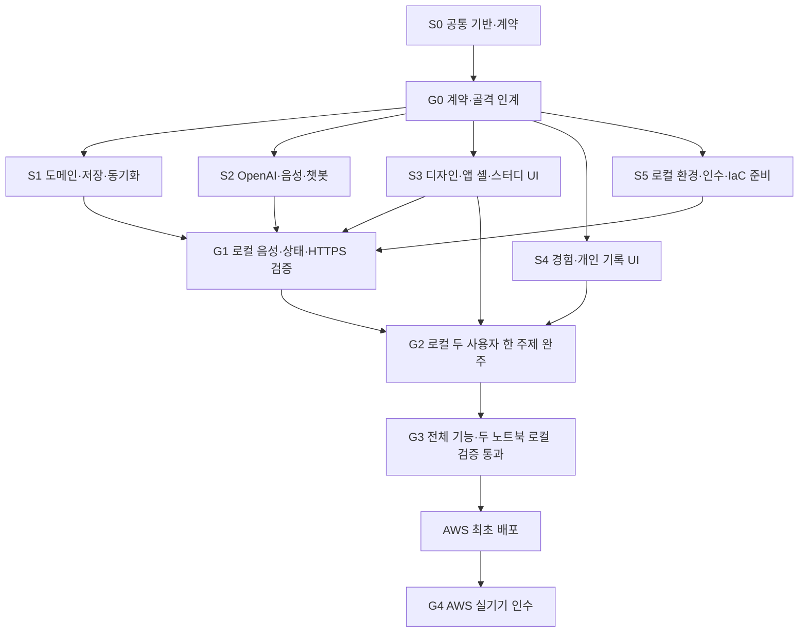

# MVP 구현 작업 계획

이 문서는 구현 세션의 실행 계획이다. 기준은 [PRD](../prd.md), [선정 아키텍처](../architecture/mvp-architecture.md), [공유 계약](shared-contracts.md)이다. 2026-10-09부터 이 계획에 따라 구현하고 있으며, 실제 실행 결과와 미실행 항목은 [로컬 검증 기록](evidence/local-validation.md)에 남긴다. 2026-10-09 G4 세션에서 사용자가 현재 코드의 G3 실기기 검증 완료를 확인했다. 해당 확인의 출처와 추가 자동 검사 결과는 로컬 검증 기록에, AWS 배포 진행은 [릴리스 기록](evidence/release.md)에 남긴다.

## 1. 작업 구조와 시작 순서

6개 세션을 사용한다. S0는 처음에 공통 기반을 만들고 이후 계약 변경·통합을 맡는다. S1~S5는 G0 이후 병렬로 진행한다. **G0~G3는 로컬 구현·검증, G3 통과 이후는 AWS 배포·G4 검증**이다. 인프라 코드 준비와 실제 AWS 배포를 구분한다. 특정 개발 일수나 팀 인원을 가정하지 않는다. 같은 사람이 여러 세션을 순서대로 수행해도 의존 관계는 유지한다.



G1은 S3/S4 전체 완료를 기다리지 않는다. 임시 개발용 음성 확인 화면과 WS 확인 클라이언트로 가장 큰 기술 위험을 로컬에서 먼저 검증한다. 이 개발용 화면이 최종 제품의 기능을 대체하지 않는다. [로컬 실행서](local-validation.md)의 DB·파일 저장·HTTPS 구성을 사용하며, G1을 위해 AWS에 먼저 배포하지 않는다.

## 2. 예정 저장소 구조와 소유권

```text
apps/
  web/
    src/app/                  # S3: 라우터·전역 초대·세션·query provider
    src/features/auth/        # S3
    src/features/study/       # S3
    src/features/chat/        # S3
    src/features/experiences/ # S4
    src/features/learning/    # S4
    src/shared/               # S3: UI 래퍼·스타일·공용 FE 어댑터
    seed-design/              # S3: 실제 SEED 스니펫
  api/
    src/app.ts                # S1: 최종 의존성 조립
    src/domain/               # S1
    src/db/                   # S1: 스키마·migration
    src/http/                 # S1: 공통/도메인 endpoint
    src/realtime/             # S1: 사용자/스터디 event fan-out
    src/storage/              # S1: 로컬 파일 / S3 adapter
    src/features/ai/          # S2: chat·audio·AI job plugin
packages/
  contracts/                  # S0
  client/                     # S0: FE가 소비할 typed client
  fixtures/                   # S0: MSW·계약 fixture
  application-ports/          # S0: S1↔S2 인터페이스, 런타임 의존성 없음
  ai/                         # S2: OpenAI provider·prompt·결과 schema 소비
  audio-client/               # S2: AudioWorklet·VAD·캡처 adapter
infra/                        # S5: CDK, G3 전에는 작성·synth만
scripts/local/                # S5: 로컬 서비스·인증서·검증 보조
scripts/deploy/               # S5
tests/e2e/                    # S5
docs/implementation/evidence/ # 후속 세션의 실제 검증 결과
```

S0가 생성한 골격 파일은 G0에서 위 소유자에게 인계한다. root package.json, lockfile, tsconfig, 공통 lint 설정, .env.example은 S0가 단독 변경한다. 각 세션은 새 의존성 목록을 S0에 요청한다. S5의 Dockerfile/compose/CI 위치도 G0에 정하고 파일별 담당을 기록한다.

외부 입력과 환경변수는 [준비 사항](prerequisites.md)을 따른다. S0가 통합 worktree를 지정하고 S5가 로컬 프로세스를 관리한다. 별도 worktree에서는 port·compose 프로젝트/volume·미디어 경로를 함께 분리하며, 동일 DB에 다른 branch의 migration을 동시에 적용하지 않는다.

여러 세션은 같은 코드베이스에서 일한다. 다른 세션의 변경을 되돌리지 않는다. 가능하면 세션별 worktree/branch를 사용하고, 공통 파일 변경은 S0가 통합한다. 별도 worktree를 사용하더라도 계약 파일을 각자 다르게 유지하지 않는다.

## 3. 작업 묶음과 의존 관계

| ID | 작업·산출물 | 담당 | 선행 | 완료 증거 |
| --- | --- | --- | --- | --- |
| T00 | 모노레포, 앱 기동, workspace·버전 고정, 공통 명령 | S0 | 없음 | 설치·typecheck·두 앱 dev 실행 |
| T01 | DTO/HTTP/event/도구/포트 스키마, fixture, typed client | S0 | T00 | 계약 검사와 fake 소비 예제 |
| T02 | SEED 실제 통합, 로컬 토큰, 앱 셸·세 주요 경로 | S3 | G0 | 실제 컴포넌트·light-only 화면 확인 |
| T03 | 사용자 식별·중복 아이디·스터디 생성·초대·입장 | S1/S3 | G0 | 두 브라우저에서 타 화면의 초대 모달 |
| T04 | DB migration, 상태 전이, 공통 WS, 명령 중복 방지 | S1 | G0 | 동시 next 테스트, snapshot 검사 |
| T05 | OpenAI 실제 모델 접근 및 혼용 발화 spike | S2 | G0 | real mic → raw/보정·provider 요청 결과 |
| T06 | PCM·VAD·구간 매핑·마감 처리·보정 저장 | S2/S1 | T04,T05 | 마지막 발화와 두 기기 표시 검증 |
| T07 | 주제 종료·문장별 피드백·편집·재요청·승인 저장 | S1/S2/S3 | T04,T06 | 다른 화자 문장 수정 후 해당 화자 기록 |
| T08 | 경험 자유 입력·선택 질문·정리·수정 저장·카드 | S2/S1/S4 | G0 | 답변 생략 포함 모든 분기 |
| T09 | 첫/다음/지명 주제, 경험 연결, 이미지/문장+지시 | S2/S1/S3 | T07,T08 | 이미지 실제 저장과 문장 fallback |
| T10 | 개인 챗봇 도구 실행·단어/표현 저장·yes/no 공유 | S2/S1/S3 | T04,T07 | 개인/공통 경계와 자연어 명령 검사 |
| T11 | 개인 학습 기록 실제 조회·원문/보정/표현 구분 | S4/S1 | T07,T10 | 새로고침 후 발화자별 조회 |
| T12 | 로컬 DB·파일 volume·HTTPS·Docker·CDK 코드/synth | S5, S1/S3 연결 | G0 | AWS 없이 G1 연결·배포 코드 준비 |
| T13 | 계약 mock 제거·전체 흐름 통합·UI 반복 수정·로컬 전체 인수 | S0/전원 | G2 | G3: A01~A27/E01~E08 로컬 통과 기록 |
| T14 | 검증된 버전 AWS 배포·두 실기기·실마이크 인수 | S5/전원 | G3 통과,T12 | G4: AWS 재검증·A28·실제 URL |

한 작업에 여러 담당이 있으면 각자 소유 경로만 수정한다. 예를 들어 T07의 영속화·승인은 S1, 생성은 S2, 검토 UI는 S3다. 작업 ID 공동 담당을 같은 파일 공동 편집으로 해석하지 않는다.

## 4. G0: 병렬 작업에 필요한 최소 기반

S0의 인계 묶음에는 다음이 있어야 한다.

- React/TypeScript/Vite와 Fastify 기동 골격, Node/pnpm 버전 및 lockfile.
- [공유 계약](shared-contracts.md)의 스키마와 endpoint registry. `any` placeholder로 잠그지 않는다.
- `StudyCommands`, `SpeechStore`, `FeedbackStore`, `AiJobs`, `EventPublisher`, `MediaStore` 등 양쪽 타입과 fake.
- 정상/생성 중/실패/수정 stale/동의 pending·yes·no/빈 목록의 fixture.
- 두 사용자 fixture와 소유자별 분리. mock event transport도 실제 Event union 사용.
- `pnpm dev:services`, `pnpm db:migrate:local`, `pnpm dev`, `pnpm dev:lan`, `pnpm preview:lan`, `pnpm build`, `pnpm typecheck`, `pnpm contracts:check`, `pnpm test:unit`, `pnpm test:integration`, `pnpm test:e2e`의 이름·실행 위치 확정. 서비스·LAN·image 실행은 S5/S3/S1이 인계 후 구현한다.
- `.env.example`에 로컬 DB, `APP_ENV`, 파일/S3 adapter, OpenAI, 로컬 HTTPS·쿠키 설정의 경계를 명시. 기동에 AWS가 필요하지 않아야 한다.
- [문서용 환경 예제](env/local.env.example)를 반영하고 `setup:local`, `preflight --target=local|lan|aws`, `smoke:openai`의 인터페이스·담당을 확정한다. 초기화/preflight는 S5, 서버 환경 parser는 S1, 실제 AI smoke는 S2가 구현한다. 타입 검사·빌드는 외부 자격증명 없이 가능하게 한다.
- S1/S2의 API plugin 조립 인터페이스, S3/S4의 feature export와 라우트 등록 규칙.

S3/S4는 MSW/fixture로 즉시 UI 작업을 시작한다. 서버 주소나 모델 응답을 화면 컴포넌트에 직접 넣지 않는다. 실제 연결 전환은 API/event adapter 한 곳에서 한다.

## 5. G1: 로컬 기술 위험 검증

이 단계의 목적은 가장 늦게 발견하면 전체 구현을 흔드는 문제를 먼저 확인하는 것이다.

| 검사 | 확인할 사실 | 실패 시 조치 |
| --- | --- | --- |
| 실제 마이크 + OpenAI 전사 | 한국어 혼용·틀린 영어·고유명사가 들린 대로 남는지 | 프롬프트/VAD/모델 설정 수정, 실제 음성 재검증 |
| 오디오 기반 두 번째 전사 | raw와 보정을 별도 저장하고 문법 교정과 분리하는지 | 텍스트 추측 보정으로 우회하지 않음 |
| segment 매핑·마감·문장 구분 | 지연된 완료·마지막 구간 및 여러 문장이 들어온 구간을 올바른 검토 행에 연결하는지 | provider adapter/flush/원문 범위 검증 수정 |
| 모델 접근·이미지 | 선택 모델 사용 가능, 실제 이미지 bytes 수신 | OpenAI 프로젝트 접근 해결 또는 검증된 OpenAI 모델 대체 기록 |
| 두 사용자 동기화 | 서로 다른 쿠키·소켓이 같은 state를 받는지 | 구독/저장 후 publish 경계 수정 |
| 로컬 HTTPS/WSS | LAN의 두 노트북에서 쿠키·WebSocket upgrade·마이크 권한 | 로컬 인증서·Vite proxy·Origin 설정 수정 |

프롬프트 품질은 성공 HTTP 코드만으로 통과하지 않는다. 녹음에 실제로 있던 문장과 결과를 사람이 비교한다. 합성/파일 음성 테스트만으로 실마이크 검증을 대체하지 않는다.

## 6. G2: 가장 먼저 완주할 제품 흐름

가입 A/B → A의 경험 저장 → A가 B 초대 → B 모달 입장 → 첫 경험 기반 이미지 주제 → 두 사람 실제 발화 → raw/보정 표시 → 주제 종료 → B가 A의 보정문 수정 → 그 문장 피드백 재요청 → 다음 주제 요청 → A의 학습 기록 자동 저장 → 다음 주제 표시.

이 흐름은 실제 OpenAI·로컬 PostgreSQL·로컬 파일의 실제 bytes·두 사용자 이벤트를 사용해야 한다. 화면 미세 조정은 이후 계속할 수 있지만 더미 데이터로 G2를 완료 처리하지 않는다. S4의 경험 카드와 기록 목록도 이때 로컬 API 서버에 연결한다. S3 adapter와 AWS 네트워크 검증은 G4에서 수행한다.

## 7. G3: 전체 기능 로컬 검증과 배포 시작 조건

[인수 기준](acceptance.md)의 A01~A27 및 E01~E08을 로컬 실제 연결로 확인한다. 두 물리 노트북·실마이크·실제 OpenAI를 사용하고, build 결과와 API image 기동·저장 데이터 재조회도 검증한다. A28은 AWS 배포 후 G4에서 판정한다. 특히 G2에서 빠질 수 있는 다음 항목을 완료한다.

- 지명한 참여자 기반 주제, 경험에 연결되지 않는 표현의 문장 주제, 둘 모두의 진행 지시.
- 경험 보충 질문에 답하지 않는 저장, 기존 경험 수정, 원문에 없는 사건 미추가.
- 단어 뜻 자동 개인 저장, 표현 학습 자동 저장, yes/no 공유와 다음 생성 입력 반영.
- 마지막 주제 검토·승인 후 스터디 종료와 발화자별 저장.
- 진행·실패 표시, 서로 다른 사용자 명령의 중복 생성 방지, 오래된 피드백 무시.

UI 반복 수정은 S3가 앱 셸·공통 디자인을, S4가 경험/기록 화면을 맡는다. 버튼을 챗봇 액션으로 바꾸거나 패널을 시트로 바꿔도 동일 명령·DTO를 유지한다. 의미 변경이 필요할 때만 S0가 계약을 조정한다.

S0/S5는 검증한 commit과 자동/수동 검사 결과를 `docs/implementation/evidence/local-validation.md`에 기록한다. 필수 로컬 항목의 실패·미실행이 남아 있으면 G3는 미통과이며 배포를 시작하지 않는다. CDK 작성·synth, Docker 빌드는 미리 할 수 있지만 bootstrap·stack deploy·ECR 게시·웹 업로드는 이 조건을 통과한 뒤 수행한다.

## 8. G4: AWS 완료 기준

2026-10-09 현재 AWS 배포·자동 연결 검증·ECS 교체 후 영속성 검증을 완료했다. [현재 인프라 다이어그램](../architecture/aws-deployed-architecture.md)과 [릴리스 증거](evidence/release.md)를 참고한다. **AWS URL에서 두 물리 노트북·실마이크로 수행하는 인수 결과는 미확인으로, T14/G4 전체는 아직 완료가 아니다.**

[G3 로컬 검증 기록](local-validation.md)을 확인한 뒤 [AWS 실행서](aws-deployment.md)에 따라 검증한 버전을 배포한다. CloudFront/ALB의 HTTPS·WSS·쿠키·캐시, IAM/Secrets, RDS, S3 등 배포 환경 차이를 확인하고 두 물리 노트북에서 [실기기 인수](acceptance.md)를 수행한다. 저장된 기록은 앱 프로세스 재시작 후에도 조회한다. 진행 중 세션 복구를 성공 조건에 넣지는 않는다.

후속 산출물 `docs/implementation/evidence/release.md`에는 배포 URL, commit SHA, lockfile/모델 설정, 수행 날짜, 테스트 결과, 실기기 증거, 남은 실패를 기록한다. 실행하지 않은 항목은 ‘미실행’으로 적는다. 현재 문서 작성 단계에서는 완료 체크나 가짜 실행 결과를 미리 채우지 않는다.

배포 후 UI/API를 수정할 때도 변경 영향에 맞는 로컬 검증과 build를 먼저 통과한 뒤 수정 배포한다. 클라우드를 기능 개발의 첫 확인 환경으로 사용하지 않는다.

## 9. 범위를 유지하는 규칙

PRD 기능을 빠른 구현이라는 이유로 제외하지 않는다. 동시에 이메일 인증·복구, 서비스 내 통화, 화자 분리 모델, 역할별 승인, 오프라인 복구, 수정 이력, 자동 시간 제한, 자동 재시도, 결제·사용량 한도, 복습 정책, 운영 대시보드를 작업에 더하지 않는다.

버튼 disabled, DB 조건부 승인, job 상태, 화면 오류, 소유자 검사, 비밀 키의 서버 보관은 핵심 기능이 실제로 동작하는 데 필요한 최소 사항이다. CI는 typecheck·계약·핵심 테스트·빌드를 중심으로 구성하고 테스트를 위해 별도 운영 플랫폼을 만들지 않는다.
