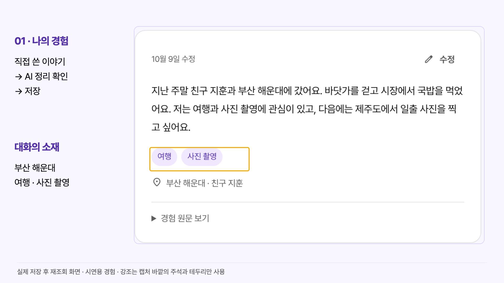
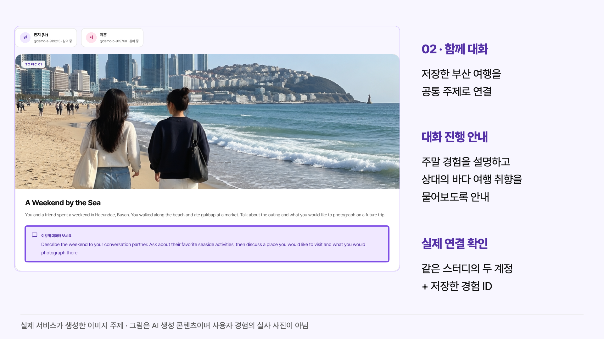
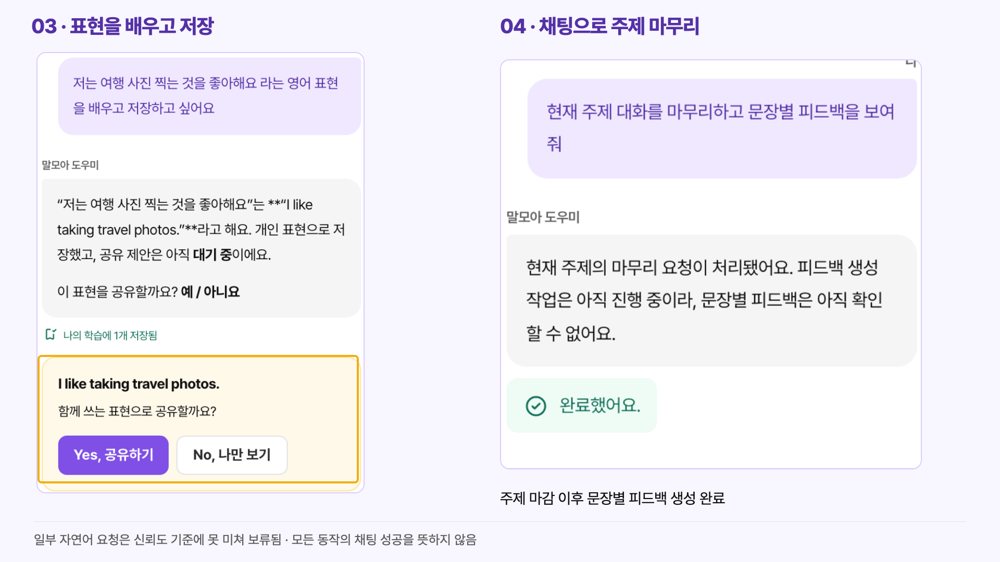
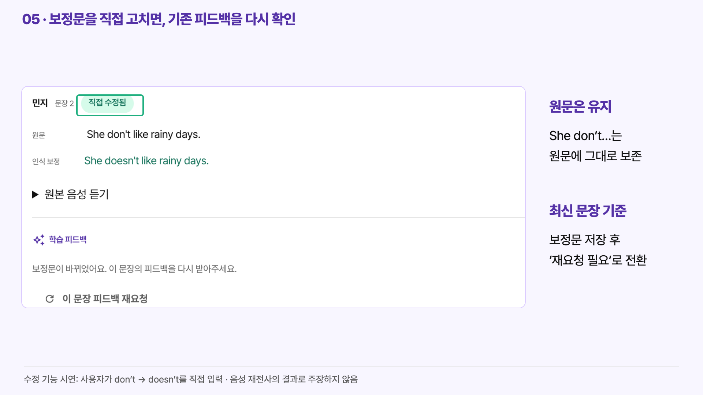
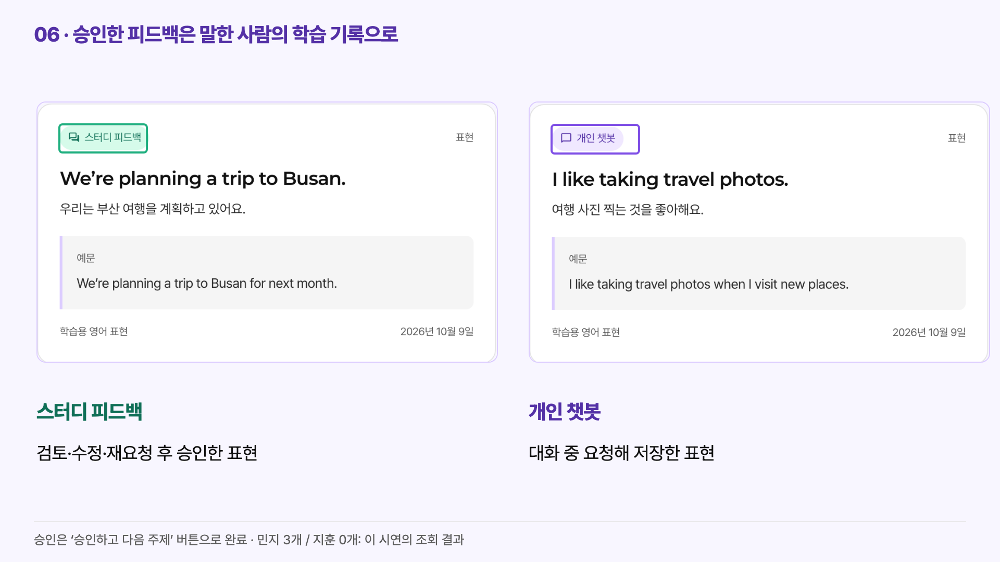
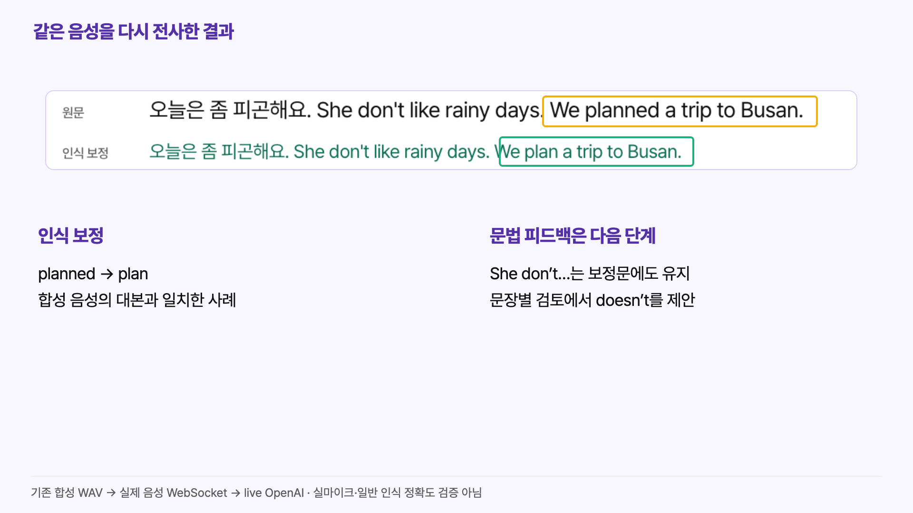
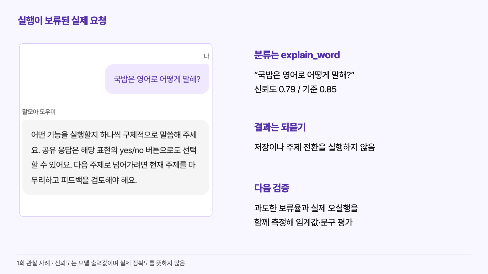

# 말모아 · 10분 프로젝트 발표 지시서

**12장 / 총 600초 / 발표 구성·문구·디자인 지시서**  
작성·실행 확인: 2026-10-09. PowerPoint 산출물은 `output/`, 이미지가 포함된 열람본은 [index.html](index.html), 구현·검증 근거는 [evidence-audit.md](evidence-audit.md)에 있다. 챗봇 분류 사례는 제작 당시 기준 `0.85`를 적용한 결과다.

발표의 중심 문장: **“그럼에도 인간관계는 여전히 중요하다. 말모아는 사람과 영어로 대화할 때 필요한 준비와 기록을 돕는다.”**

말모아는 기존 지인을 아이디로 초대해 함께 영어를 연습하는 서비스다. 새 친구 매칭, AI 친구, 상대 음성을 전달하는 통화 서비스로 설명하지 않는다. 현재 구현에 가장 자연스러운 사용 장면은 **이미 만나는 두 사람이 각자 브라우저를 열고 진행하는 영어 스터디**다. 문제의 보편성·수요·관계 증진 효과는 아직 검증하지 않은 가설이다.

## 먼저 확정할 발표 표현

| 초안의 표현 | 코드와 이번 실행을 반영한 발표 표현 |
| --- | --- |
| STT 결과를 LLM으로 보정 | 원본 음성과 맥락을 `gpt-transcribe`에 다시 전달해 인식 보정. `gpt-6-luna`의 문장별 학습 피드백은 그다음 단계 |
| OpenAI의 “decisoins 모델” | **Decisions API**, 코드의 호출 주소는 `POST /v1/decisions`. 사용 모델은 `gpt-6-luna` |
| STT가 문장을 판단하지 못함 | **음성 전송 구간이 학습할 한 문장과 일치하지 않는 문제**. STT 전반의 능력을 단정하지 않음 |
| Decisions로 문장 저장 | Decisions는 발화 묶음의 완료 여부를 판단. 주제 마감 때 Responses 구조화 출력이 문장을 분할하고, 서버가 출처·순서·누락을 검증 |
| AI가 챗봇 권한을 판단 | AI는 서버가 제공한 행동 중 의도를 분류. **권한·상태·버전은 서버가 검사** |
| 채팅으로 대부분의 동작 처리 | **핵심 기능을 채팅으로 요청할 수 있음**. 이번에는 표현 학습·저장과 주제 마감을 확인. 공유·다음 주제의 자연어 요청은 보류되어 버튼으로 완료 |

## 시간표

전환과 화면을 가리키는 시간을 포함한 배분이다. Q&A는 포함하지 않는다. 6분 40초에 9번, 8분 25초에 11번 슬라이드로 진입한다.

| # | 구간 | 초 | 주제 | 주요 심사기준 |
| --- | --- | ---: | --- | --- |
| 01 | 0:00–0:40 | 40 | AI가 인간을 대체할까? | 01 문제 |
| 02 | 0:40–1:25 | 45 | 그럼에도 인간관계는 여전히 중요하다 | 01 문제 |
| 03 | 1:25–2:15 | 50 | 경험과 관심사 저장 | 02 판단 · 03 결과물 |
| 04 | 2:15–3:10 | 55 | 우리 경험으로 함께 대화 | 02 판단 · 03 결과물 |
| 05 | 3:10–4:00 | 50 | 채팅으로 표현 학습과 진행 요청 | 03 결과물 |
| 06 | 4:00–4:50 | 50 | 문장 검토·직접 수정·개인 학습 | 03 결과물 · 04 개선 |
| 07 | 4:50–5:50 | 60 | OpenAI 모델과 서비스 연결 | 02 판단 · 03 결과물 |
| 08 | 5:50–6:40 | 50 | 인식 보정과 학습 피드백의 구분 | 02 판단 · 04 개선 |
| 09 | 6:40–7:45 | 65 | 발화 완료 판단과 챗봇 행동 선택 | 02 판단 |
| 10 | 7:45–8:25 | 40 | 이번에 확인한 결과와 남은 검증 | 04 검증 |
| 11 | 8:25–9:15 | 50 | 도입 가설: 대학 영어회화 스터디 | 05 도입 가능성 |
| 12 | 9:15–10:00 | 45 | Codex로 구현하고, 발견한 문제로 개선 | 06 Codex |
| **합계** | **0:00–10:00** | **600** | | |

## 공통 디자인 지시

서비스의 [design/tokens.css](../../design/tokens.css), [디자인 시스템 문서](../../design/design-system.html), [SEED 매핑](../../apps/web/src/shared/seed-theme.css)을 따른다. 새로운 시각 테마를 만들지 않는다.

| 요소 | 적용값과 사용 목적 |
| --- | --- |
| 화면 | 16:9, 13.333 × 7.5인치. 제작 좌표 기준은 1920 × 1080 |
| 배경·표면 | `#F8F6FF` / 흰색 `#FFFFFF`. 다크 테마는 코드의 제안 상태이므로 이번 발표에는 사용하지 않음 |
| 본문 | `#111111`, 보조 설명 `#5D5D5D` |
| 보라 | `#7F4FE6`, 진한 글자 `#5431A6`, 연한 바탕 `#F0E8FF`: 서비스·기능·주요 강조 |
| 민트 | `#1FAF7F`, 글자 `#106F57`: 확인·저장·최신 결과 |
| 노랑 | `#F0AF14`, 연한 바탕 `#FFF3CF`: 지금 설명하는 영역·검토 필요 |
| 로즈 | `#EF4A88`: 상대 참여자. 성과·위험을 임의로 이 색에 연결하지 않음 |
| 글꼴 | Pretendard Variable / Pretendard. 영문 워드마크 Montserrat. 서비스와 같은 폰트이며 미설치 시 설치하거나 내보낼 때 포함 |
| 크기 | 도입 48–56pt, 일반 제목 32–36pt, 본문 22–26pt, 모델명·표 18–20pt, 출처·제약 13–15pt. 핵심 내용을 각주로 숨기지 않음 |
| 모서리 | 서비스의 8/12/16px 반경을 기준으로 통일. 화면 캡처 테두리는 가늘게, 설명 대상 테두리만 3–4px |
| 전환 | 없음 또는 0.2초 페이드. 04·06의 화면 교체는 같은 슬라이드 안에서 진행하고 시간표에 포함 |

서비스에는 별도 로고 이미지 파일이 없고, 헤더가 Material Symbols Rounded의 `forum` 아이콘과 “말모아 / MALMOA”를 조합한다. 기존 UI를 그대로 캡처한 [brand-from-ui.png](assets/annotated/brand-from-ui.png)를 흰 바탕에 비율 유지해 사용한다. 로고를 새로 그리거나 별도 캐릭터를 만들지 않는다.

캡처 슬라이드는 아래 **1920 × 1080 주석 이미지**를 전체 화면에 비율 유지해 배치할 수 있다. 이미 제목 역할의 설명이 들어 있으므로 제목을 덧붙여 화면을 축소하지 않는다. 문구·테두리를 PPT에서 편집해야 한다면 동일 이름의 HTML과 원본 PNG를 참고해 별도 개체로 옮긴다. 긴 원본 전체 화면을 작게 붙이지 않는다. 핵심 UI가 작은 경우 제공된 부분 확대본을 우선한다.

캡처 편집은 원본 PNG의 자르기·균일 확대, 바깥 설명과 테두리만 사용했다. 모델로 UI를 재생성하지 않았고 원본 안의 글자·상태·결과를 교체하지 않았다. 주변 명도 낮추기나 화살표는 설명에 필요하지 않아 일괄 적용하지 않았다. 이미지 안의 해운대 장면은 **서비스가 실제 Images API로 생성한 대화 소재**이며, 사용자 경험의 실사 사진은 아니다.

---

## 01 · AI가 인간을 대체할까?

**0:00–0:40 · 40초 / 목적:** 취업과 뒤처짐에 대한 불안을, 사람과의 만남에 대한 질문으로 넓힌다.

**화면 문구**

> AI가 인간을 대체할까?
>
> 취업 기회도, 함께 공부하던 시간도?

첫 15초 뒤 아래 질문으로 교체한다.

> 친구의 역할과 새로운 사람과의 만남도 대체할까?

**발표 대본**

“AI를 보면서 이런 생각을 해본 적 있으신가요? 내가 준비한 일을 AI가 대신하면, 나만 뒤처지는 건 아닐까. 취업 기회에 대한 불안에서 출발한 질문은 일상으로 이어집니다. 영어를 공부하려고 사람을 만나고 스터디를 하던 시간도, 이제 AI와 혼자 연습할 수 있습니다. 그렇다면 친구의 역할이나 새로운 사람을 만나는 경험까지 AI로 충분해질까요?”

**디자인·진행:** 여백이 넓은 연보라 배경. 질문을 좌측 64px / 세로 중앙에 100px 내외로 배치한다. “인간”, 다음 화면의 “만남”만 보라로 강조한다. 이미지·통계·일자리 감소 그래프를 넣지 않는다. 질문 뒤 2초 정지한다.

**근거 수준:** 공감을 위한 질문이며 실제 고용 감소나 사용자의 FOMO를 조사한 결과가 아니다.

## 02 · 그럼에도 인간관계는 여전히 중요하다

**0:40–1:25 · 45초 / 목적:** 인간관계라는 가치에서 실제 영어 스터디의 사용 맥락으로 연결한다.

**화면 문구**

> 그럼에도 인간관계는 여전히 중요하다
>
> 말모아 · 사람과 나누는 영어 대화를 돕는 AI

아래에는 평평한 한 줄 흐름을 둔다.

> 내 경험을 남기고 → 함께 대화하고 → 배운 표현을 다시 본다

작은 상황 문구: “기존 지인과 하는 영어 스터디 · 매번 주제 준비와 표현 정리를 해야 하는 상황”

**발표 대본**

“저희가 지키고 싶은 것은 사람과 함께 이야기하는 시간입니다. 말모아는 기존 지인을 초대해 영어로 대화하는 스터디를 지원합니다. 모임에서는 무엇을 이야기할지 준비하고, 말하다 막힌 표현을 찾고, 끝나면 배운 내용을 다시 정리해야 합니다. 이 부담을 줄이면 서로의 경험을 듣는 데 더 집중할 수 있다는 가설에서 시작했습니다. 개인의 경험을 대화 주제로 연결하고, 대화 후에는 내 학습 기록으로 남깁니다.”

**디자인·진행:** 로고를 좌측 상단의 흰 영역에 배치. 중심 문장은 44pt. 사람을 뜻하는 로즈와 서비스를 뜻하는 보라를 소량만 쓴다. 세 단계를 카드 격자로 만들지 않고 넓은 간격의 텍스트·얇은 화살표로 연결한다.

**차별점과 범위:** 경험·실제 발화·개인 복습 기록이 같은 스터디 흐름에 이어진다. 일반 AI 대화 대비 우월성이나 관계 증진 효과를 검증했다고 말하지 않는다. 새로운 사람 매칭·화상/음성 통화는 현재 기능이 아니다. [근거 E01·E02](evidence-audit.md#e01-서비스-맥락과-화면)

## 03 · 경험과 관심사를 다음 대화의 소재로

**1:25–2:15 · 50초 / 사용자 행동:** 나의 경험 입력 → 정리된 경험·관심사 확인 → 저장 → 재조회.

**화면 문구:** 이미지에 포함된 “01 · 나의 경험”, “직접 쓴 이야기 → AI 정리 확인 → 저장”, “부산 해운대 / 여행 · 사진 촬영”.

**발표용 파일:** `docs/presentation/assets/annotated/s03-experience.png`  
**원본:** [입력](assets/raw/01-experience-input.png), [정리 확인](assets/raw/02-experience-review.png), [저장 후 재조회](assets/raw/03-experience-saved.png)

**발표 대본**

“민지와 지훈이라는 시연 계정으로 시작하겠습니다. 민지가 부산 해운대에 갔던 경험과 여행, 사진 촬영에 대한 관심을 적습니다. AI는 입력에 근거해 경험과 맥락을 정리하고, 사용자가 확인한 뒤 저장합니다. 지금은 저장 후 다시 접속한 화면입니다. 노란 테두리 안에 여행과 사진 촬영이 남아 있습니다. 짧은 입력에는 보충 질문을 선택적으로 받을 수 있지만, 이번처럼 구체적인 입력은 확인 단계로 바로 이어졌습니다. 다음에는 이 기록으로 함께 이야기할 주제를 만듭니다.”

**디자인·진행:** 전체 화면 주석 이미지. 저장 카드가 화면의 약 70%를 차지하도록 확대했다. 관심사에만 노란 테두리. 첫 15초는 행동을 설명하고, 다음 20초는 카드의 경험·관심사를 가리킨다. 마지막 15초에 다음 화면을 연결한다.

**확인:** 실제 Responses 호출, 저장·재조회까지 실행했다. 보충 질문 분기는 코드에서 확인한 기능이며 이번 시연에서는 발생하지 않았다. 원문에 없는 사건을 생성하지 않도록 문자열 근거 검사를 하는 구현이다. [근거 E02](evidence-audit.md#e02-경험과-주제-생성)

## 04 · 우리 경험으로 함께 대화

**2:15–3:10 · 55초 / 사용자 행동:** 상대 아이디로 초대 → 지훈이 참여 → 첫 주제 시작 → 주제를 보며 대화.

**화면 문구:** “02 · 함께 대화”, “저장한 부산 여행을 공통 주제로 연결”, “대화 진행 안내”.

**발표용 파일:** `docs/presentation/assets/annotated/s04-topic.png`  
**원본:** [상대에게 도착한 초대](assets/raw/04-invitation.png), [공통 주제](assets/raw/05-topic.png), [음성 처리 후 화면](assets/raw/08-transcript.png)

**발표 대본**

“상대 아이디로 초대하고 지훈이 참여하면 같은 스터디에 들어옵니다. 첫 주제를 시작하자 저장했던 부산 여행을 바탕으로 ‘A Weekend by the Sea’라는 주제가 만들어졌습니다. 이미지만 있는 것이 아니라, 주말 경험을 설명하고 상대의 바다 여행 취향을 물어보라는 안내도 나옵니다. 두 사람은 이 소재를 보고 이야기합니다. 음성 처리도 실제 서비스에 연결해 원문과 인식 보정문이 화면에 나타나는 것을 확인했습니다. 이번 캡처의 음성은 합성 테스트 파일이며, 사람의 실마이크 발화 검증은 아닙니다.”

**디자인·진행:** 0–10초 초대 설명, 10–40초 주제 이미지와 보라 테두리의 안내, 40–55초 [s08-transcript.png](assets/annotated/s08-transcript.png)로 같은 슬라이드 안에서 교체해 음성 결과를 보여준다. 이때 모델 설명은 하지 않고 “원문과 보정문을 함께 보여준다”까지만 말한다. 08번에서 같은 근거를 기술 설명용으로 다시 확대한다.

**확인:** 새 계정 두 개가 같은 스터디에 참여했다. 주제의 `sourceExperienceIds`가 저장한 경험 ID와 일치한다. 합성 WAV 한 파일을 브라우저 WebSocket으로 전송해 실제 Realtime·Audio API 결과를 받았다. 캡처의 마이크 버튼은 꺼진 상태이므로 “마이크를 켜서 녹음한 화면”이라고 설명하지 않는다. [근거 E02·E03](evidence-audit.md#e03-음성-보정과-문장-검토)

## 05 · 채팅으로 필요한 표현과 진행을 요청

**3:10–4:00 · 50초 / 사용자 행동:** 표현 학습 요청 → 개인 저장·공유 제안 → 주제 마감 요청 → 문장 검토 준비.

**화면 문구:** “03 · 표현을 배우고 저장”, “04 · 채팅으로 주제 마무리”.

**발표용 파일:** `docs/presentation/assets/annotated/s05-chat.png`  
**원본:** [표현 학습 요청](assets/raw/06b-chat-expression.png), [주제 마감 후 검토](assets/raw/09-review.png)

**발표 대본**

“대화 중 표현이 막히면 개인 도우미에게 요청합니다. ‘여행 사진 찍는 것을 좋아한다는 표현을 배우고 저장하고 싶다’고 하니, 영어 표현과 함께 개인 학습 기록 한 개가 저장됐습니다. 함께 쓰려면 별도로 공유를 선택합니다. 또 ‘현재 주제 대화를 마무리하고 문장별 피드백을 보여줘’라는 요청이 실제 주제 마감으로 연결됐습니다. 다만 모든 자연어 요청이 성공한 것은 아닙니다. 이번 실행에서 공유와 다음 주제 요청은 보류돼 버튼으로 진행했고, 그 원인은 뒤에서 설명하겠습니다.”

**디자인·진행:** 왼쪽 요청·저장·공유 제안을 먼저 25초, 오른쪽 주제 마감 요청과 상태를 25초 설명한다. 왼쪽은 공유 선택 영역만 노란 테두리로 강조한다. 오른쪽 대화의 “생성 중” 설명은 그 시점의 응답이며, 초록 상태는 이후 작업 완료다. 원문을 고쳐 “이미 완료된 답변”처럼 만들지 않는다.

**구현 범위:** 현재 챗봇은 Decisions 분류 → 선택한 기능 인자 추출 → 서버에서 1회 실행 → 결과 설명 순서다. 가입·초대·경험 작성·보정문 편집까지 모두 채팅으로 된다고 주장하지 않는다. 개인 저장과 공통 공유를 구분한다. [근거 E04](evidence-audit.md#e04-챗봇의-판단과-서버-실행)

## 06 · 문장을 확인하고, 내 학습 기록으로

**4:00–4:50 · 50초 / 사용자 행동:** 원문·보정문 비교 → 직접 수정 → 문장 피드백 재요청 → 승인 → 나의 학습.

**화면 문구:** “05 · 보정문을 직접 고치면, 기존 피드백을 다시 확인”, “06 · 승인한 피드백은 말한 사람의 학습 기록으로”.

**발표용 파일:** `docs/presentation/assets/annotated/s06-review-edit.png`, `docs/presentation/assets/annotated/s06-learning.png`  
**원본:** [수정 입력 중](assets/raw/11-editing.png), [수정 저장 직후](assets/raw/12-edited-stale.png), [재요청 완료](assets/raw/13-refeedback.png), [다음 주제](assets/raw/14-next-topic.png), [개인 학습](assets/raw/15-learning.png)

**발표 대본**

“주제를 마치면 이번 음성이 세 문장으로 나뉘어 검토 화면에 나타납니다. 원문과 보정문을 비교하고 원본 음성 재생도 요청할 수 있습니다. 수정 기능을 보여드리기 위해 제가 ‘She don’t’를 ‘She doesn’t’로 직접 바꿨습니다. 원문은 남고, 기존 피드백에는 재요청이 필요하다고 표시됩니다. 재요청 후 이 문장은 추가 피드백이 없다는 결과가 나왔습니다. 마지막으로 버튼으로 승인하니, 학습할 표현이 말한 사람의 기록으로 저장됐습니다. 챗봇에서 저장한 표현도 출처를 구분해 함께 볼 수 있습니다.”

**디자인·진행:** 처음 30초 수정 화면, 뒤 20초 학습 기록으로 같은 슬라이드 안에서 교체. 두 이미지를 작게 나란히 두지 않는다. “직접 수정됨”과 “스터디 피드백 / 개인 챗봇”에만 서비스 의미색을 사용한다.

**확인과 한계:** 보정문 수정은 **시연자가 실제 UI로 입력한 문법 수정**이다. 음성 모델이 `doesn’t`로 바꿨다고 말하지 않는다. 최신 보정 버전 피드백을 재생성했고, 승인 후 민지 기록 3개·지훈 기록 0개를 조회했다. 이는 이 시연의 결과이지 사용자 성과 지표가 아니다. 원본 오디오 재생 UI는 확인했으나 이번 실행에서 재생·청취 평가는 하지 않았다. [근거 E03·E05](evidence-audit.md#e05-승인과-개인-학습-저장)

## 07 · OpenAI 모델을 서비스의 단계별로 연결

**4:50–5:50 · 60초 / 목적:** 어떤 입력을 어떤 모델에 보내며 왜 역할을 나누었는지 설명한다.

**화면 문구 및 표**

| 역할 | 실제 설정 모델 | 연결 API |
| --- | --- | --- |
| 경험·주제·문장 피드백·챗봇 처리 | `gpt-6-luna` | Responses |
| 발화 완료·챗봇 행동 분류 | `gpt-6-luna` | Decisions |
| 실시간 원문 전사 | `gpt-live-transcribe` | Realtime transcription |
| 같은 음성 재전사 | `gpt-transcribe` | Audio Transcriptions |
| 대화 주제 이미지 | `gpt-image-2.5-flare-2026-09-08` | Images |

아래에 편집 가능한 한 줄 구조도를 둔다.

> React · SEED → Fastify HTTP / WebSocket → OpenAI + PostgreSQL · 미디어 저장소

**발표 대본**

“모델은 하는 일에 맞춰 연결했습니다. gpt-6-luna는 경험 정리와 주제 설계, 문장 분할, 학습 피드백을 구조화된 데이터로 만듭니다. 발화 완료와 챗봇 행동 선택에는 같은 모델을 Decisions API로 호출합니다. 음성은 gpt-live-transcribe로 원문을 받고, gpt-transcribe에 같은 음성을 다시 전달해 보정합니다. 주제 그림은 표에 적힌 이미지 모델을 사용합니다. 모델 출력만으로 완료라고 표시하지 않고, 서버가 결과를 검증하고 저장한 뒤 화면을 갱신합니다. 지금 모델명은 문서에서 추정한 것이 아니라 이번 실행 설정과 호출 기록에서 확인한 값입니다.”

**디자인·진행:** 표를 네이티브 개체로 작성. 좌우 여백 64px, 제목 y=60, 표 y=210–770. 모델명은 18–20pt로 한 줄 유지하되 가장 긴 이미지 모델만 2줄 허용. 브랜드 로고 모음·불필요한 코드 스크린샷을 넣지 않는다. 상세 입력·출력은 부록에 두고 이 장에서는 역할을 읽는다.

**확인:** 위 다섯 API 경로의 live 호출 메타데이터를 이번 실행에서 확보했다. 운영 모델은 환경변수로 변경할 수 있다. `gpt-4o-mini-tts`는 별도 개발 테스트 도구의 모델이며 서비스의 사용자 음성 출력 기능으로 넣지 않는다. AWS 배포 성공은 이번 캡처로 검증하지 않았다. [근거 E06](evidence-audit.md#e06-모델과-api-호출)

## 08 · 무엇을 보정했는지 사용자가 확인할 수 있게

**5:50–6:40 · 50초 / 목적:** 실제 STT 차이와 개선 인터페이스를 연결한다.

**화면 문구:** “같은 음성을 다시 전사한 결과”, “인식 보정: planned → plan”, “문법 피드백은 다음 단계”.

**발표용 파일:** `docs/presentation/assets/annotated/s08-transcript.png`  
**원본:** [원문·보정 화면](assets/raw/08-transcript.png), [문법 피드백](assets/raw/09-review.png)

**발표 대본**

“전사문 하나만 보여주면 AI가 무엇을 바꿨는지 알기 어렵습니다. 이번 파일의 대본은 ‘We plan a trip to Busan’인데 실시간 전사에는 ‘planned’가 나왔습니다. 같은 음성을 다시 전사한 보정문에는 ‘plan’이 나타났습니다. 반면 ‘She don’t’는 보정문에도 그대로 있습니다. 이 부분의 영어 문법 설명은 이후 학습 피드백이 담당합니다. 그래서 원문, 인식 보정문, 학습 피드백을 분리했습니다. 보정도 틀릴 수 있으므로 사용자가 비교하고 직접 수정한 뒤 최신 문장으로 다시 피드백을 받게 했습니다.”

**디자인·진행:** 04에서 본 화면의 전사 영역을 3.05배로 확대했다. 원문 차이는 노랑, 보정 결과는 민트 테두리. 말할 때 두 줄만 가리킨다. “완벽한 STT”, “정확도 향상률” 같은 새 수치를 넣지 않는다.

**판정:** `planned → plan`은 이번 합성 파일의 대본과 일치한 사례다. 실마이크 인식 정확도 개선의 일반적 증거가 아니다. 이전 BlackHole 테스트에는 짧게 분리된 발화의 `예약 → Về呀`, `품절 → 혼자` 같은 오류가 기록돼 있다. 원인과 전체 개선 정도는 미확정이며, 발표 대본에서는 필요할 때만 한 사례를 추가하고 50초를 넘기지 않는다. [근거 E03·E07](evidence-audit.md#e07-검증과-남은-실패)

## 09 · 발화가 끝났는지, 어떤 기능을 요청했는지

**6:40–7:45 · 65초 / 목적:** Decisions의 실제 역할과 서버가 맡는 판단을 구분한다.

**화면 문구**

> Decisions API · 모델 `gpt-6-luna`

위쪽의 음성 흐름:

> 전송 조각 → 발화 완료 판단 → 묶음 음성 보정 → 문장 분할 → 검토·승인

각 연결의 작은 라벨: “Decisions” / “Audio” / “Responses + 서버 출처 검사” / “사용자 + 서버”

아래쪽의 챗봇 흐름:

> 요청 + 현재 상태 → 허용된 행동 중 선택 → 인자 검증 → 서버 실행

큰 보조 문구: **“행동의 의미는 AI가 분류하고, 실행 권한은 서버가 확인한다”**

**발표 대본**

“처음 발견한 문제는 전송을 위해 나눈 음성 조각이 학습할 한 문장과 다르다는 점이었습니다. 같은 화자의 전사와 맥락, 침묵 시간을 Decisions에 보내 완료, 계속, 불확실 중 하나를 받습니다. 완료 신뢰도가 기준에 못 미치면 기다리고, 최대 침묵 10초에서 묶음을 확정합니다. 그 뒤 보정한 내용을 주제 마감 시 Responses로 문장 단위로 나눕니다. 서버는 출처 누락이나 중복, 다른 화자의 혼합을 검사합니다. 챗봇도 요청과 현재 상태로 가능한 행동만 분류합니다. 권한을 AI가 새로 만들 수는 없고, 서버가 사용자와 주제, 최신 버전을 확인한 뒤 실행합니다.”

**디자인·진행:** 편집 가능한 수평 흐름도 두 줄. 카드 장식 없이 구간명과 얇은 화살표를 사용한다. 음성 35초 / 챗봇 30초. “문장 분할” 아래의 Responses 라벨을 생략하지 않는다. 상세 정책 `1초 후 판단 / 완료 ≥0.85 / 최대 침묵 10초`를 상단 흐름 아래 20pt로 넣는다. 0.85는 설계 기준이며 정확도 수치가 아니다.

**실제 관찰:** 이번 발화는 `complete / 0.67`로 기준 미달이어서 `silence_timeout`으로 확정됐다. Decisions가 조기에 완료시킨 성공 사례로 바꾸지 않는다. 챗봇도 0.85 미만 또는 미허용 행동이면 실행 없이 되묻는다. 주제 전환·피드백 승인에는 별도의 서버 상태 검사가 있다. [근거 E03·E04·E06](evidence-audit.md)

## 10 · 확인한 결과와 다음 검증

**7:45–8:25 · 40초 / 목적:** 성공과 실패를 근거 범위에 맞게 제시한다.

**화면 문구:** “실행이 보류된 실제 요청”, “0.79 < 기준 0.85”, “다음 검증: 과도한 보류와 오실행을 함께 측정”.

**발표용 파일:** `docs/presentation/assets/annotated/s10-clarification.png`  
**원본:** [단어 요청 보류](assets/raw/06-chat-expression.png), [다음 주제 요청 보류](assets/raw/14a-next-clarified.png)

**발표 대본**

“실제 저장부터 주제 생성, 문장 수정과 개인 학습까지 연결했고, 관련 네 테스트 파일의 76개 검사도 통과했습니다. 한계도 확인했습니다. ‘국밥은 영어로 어떻게 말해’는 단어 요청으로 분류됐지만 신뢰도 0.79여서 실행되지 않았습니다. 공유와 다음 주제 요청도 보류됐습니다. 원치 않는 실행을 막는 기준이 평범한 요청까지 막는지 평가해야 합니다. 다음에는 실마이크의 멈춤과 혼용 발화, 요청별 보류율을 확인하겠습니다. 사용자 학습 효과와 장기 사용은 아직 검증하지 않았습니다.”

**디자인·진행:** 실제 되묻기 화면을 20초 보여준 뒤, 필요하면 동일 배경에 세 줄 검증 요약을 네이티브 텍스트로 교체한다: “직접 확인: live 흐름·관련 76개 검사 / 이번 관찰: 일반 요청도 보류 / 다음 검증: 실마이크·사용성·학습 효과”. 실패를 작은 각주로 숨기지 않는다.

**근거 수준:** 단위 테스트는 네 개 파일에 한정한다. 이전 문서의 전체 테스트 수와 합산하지 않는다. 브라우저 세션 두 개는 물리 기기 두 대 테스트가 아니다. 이번 검사는 합성 음성 전송과 AI 처리·저장 흐름을 확인했으며 AudioWorklet·VAD·물리 마이크 수집은 검증하지 않았다. [근거 E07](evidence-audit.md#e07-검증과-남은-실패)

## 11 · 첫 도입 가설: 대학 영어회화 스터디

**8:25–9:15 · 50초 / 목적:** 현재 기능에 맞는 하나의 도입 방향과 검증 계획을 제안한다.

**화면 문구**

> 도입 가설 · 대학 영어회화 스터디
>
> 이용자: 정기적으로 만나는 한국어권 학습자 2인
>
> 운영자: 동아리·소규모 회화 프로그램 담당자
>
> 구매 후보: 대학 어학교육원·비교과 프로그램 담당 부서

아래 두 줄:

> 기대 가치: 주제 준비와 수업 후 표현 정리의 부담 감소
>
> 첫 검증: 4주 시범 운영에서 준비 시간·재참여·복습을 관찰

**발표 대본**

“첫 도입 후보는 정기적으로 만나는 대학 영어회화 스터디입니다. 이미 관계와 모임 시간이 있어 현재의 아이디 초대 방식과 잘 맞습니다. 학생 두 명이 사용하고, 동아리나 회화 프로그램 담당자가 시범 운영을 맡는 형태를 제안합니다. 구매 후보는 대학 어학교육원이나 비교과 담당 부서입니다. 주제 준비와 표현 정리의 부담을 줄이고, 누적된 경험과 학습 기록을 다음 모임에 다시 쓰는 것이 기대 가치입니다. 다만 구매 의사와 절감 효과는 가설입니다. 4주 파일럿에서 준비 시간, 다시 참여하는지, 기록을 복습하는지를 먼저 확인하겠습니다.”

**디자인·진행:** 상단에 “도입 가설”을 24pt 보라 글자로 계속 표시한다. 사용자·운영자·구매자를 세 행의 간단한 표로 두고, 아래에 기대 가치와 첫 검증을 배치한다. 기업·공공기관·학교·지역사회 로고를 나열하지 않는다. 가짜 계약·매출·시장 규모 수치를 넣지 않는다.

**사업 가설의 구체화:** 4주 후 조건부로 프로그램 단위 이용권이나 활성 스터디 단위 과금 의향을 인터뷰한다. 가격은 미정이다. 운영자는 참여 안내와 모임 진행을 맡고 참여자는 자신의 전사·공유를 확인한다. 현재 기관 관리 대시보드·과금·자동 복습 알림은 없으므로 파일럿 운영은 외부 진행표로 보완해야 한다. 비용은 `음성 처리량 + 텍스트/판단 호출 + 주제 이미지 + 저장/서버`로 계산하고, 동일 스터디의 준비·정리 시간 변화와 비교한다. 비용·대기시간 절감은 아직 측정하지 않았다. 사업성 표본·도입 의사·유지율도 미확인이다. [제안 근거와 검증안](evidence-audit.md#e08-도입-가설)

## 12 · Codex에 맡기고, 실제 문제로 개선

**9:15–10:00 · 45초 / 목적:** 구체적인 Codex 활용·검토·통합 과정을 보여주고 인간관계 메시지로 돌아온다.

**화면 문구**

| 발견한 문제 | Codex와 진행한 작업 | 결과 확인 |
| --- | --- | --- |
| 전사가 끊겨 문맥이 나뉨 | 음성 테스트 모듈, Decisions 발화 묶음 | 저장·보정·리뷰에 연결, 경계 테스트 |
| 챗봇이 부적절한 요청을 처리 | 가능한 행동 분류와 서버 실행 제한 | 이번 실행에서 성공·보류를 함께 확인 |

마지막 8초에 아래 문장만 남긴다.

> 사람과 이야기하는 시간은 이어가고, 준비와 기록은 말모아가 돕습니다

**발표 대본**

“Codex 활용은 문제를 발견하고 수정하는 과정에 있었습니다. 전사가 끊기는 것을 보고 음성 테스트 모듈과 Decisions 기반 발화 묶음으로 발전시켰습니다. 챗봇의 이상한 요청 처리도 발견해 가능한 행동 안에서 분류하고 서버가 실행하도록 제한했습니다. 코드 변경은 전사 저장과 검토 화면, 서버 명령에 통합했고 테스트와 실제 실행으로 확인했습니다. 여전히 과도한 보류와 음성 품질은 개선할 부분입니다. 사람과 이야기하는 시간은 이어가고, 준비와 기록은 말모아가 돕겠습니다.”

**디자인·진행:** 두 행의 표, 제목 34pt / 본문 23pt. 표 아래 작은 근거 `6e802a9 · 0d7d7d0 · 35290d3`. 37초에 표를 페이드아웃하고 마지막 문장과 기존 로고만 남긴다. “Codex가 전부 만들었다”, “개발시간 몇 % 단축” 같은 검증 없는 표현을 넣지 않는다.

**근거 수준:** 문제 발견과 Codex에 맡긴 경위는 이번 대화에서 받은 사용자 설명이다. 테스트 모듈·발화 묶음·챗봇 제한의 코드와 통합 경로는 직접 확인했다. Codex 대화 원문이나 사람이 수정한 모든 라인, 소요 시간은 확인하지 않았다. [근거 E09](evidence-audit.md#e09-codex-활용-근거)

---

## 심사기준별 근거 연결

세부 배점과 제출물 가이드는 아직 미정이다. 아래는 여섯 기준의 내용 연결이며 점수 예측이 아니다.

| 기준 | 발표 위치 | 이번에 제시할 근거 | 미검증·후속 항목 |
| --- | --- | --- | --- |
| 01 문제 정의와 필요성 | 01–02 | 사람끼리 영어 스터디를 하는 코드상 사용 흐름, 준비·표현 탐색·정리 문제 가설 | 실제 사용자의 빈도·불편 강도, 기존 방식 대비 필요성 인터뷰 |
| 02 AI 판단과 해결 방식 | 03–04, 07–09 | 입력 경험 ID, 정확한 모델/API, 구조화 출력, Decisions 분류, 서버 검사 | 주제 적절성·문장 분할 품질·보류율의 대표 표본 평가 |
| 03 작동하는 결과물 | 03–06 | live UI·HTTP/WS·PostgreSQL·미디어 연결, 원본/강조 캡처, 실제 학습 기록 | 현 버전의 실마이크·두 물리 기기·운영 배포는 이번 범위 밖 |
| 04 검증과 개선 | 06, 08, 10 | 전사 차이, 직접 수정·재요청, 76개 관련 단위 검사, 실패한 자연어 요청 | 사용성·학습 효과, 재전사 충실도, 개선 전후 동일 음성 비교 |
| 05 사업성 및 도입 가능성 | 11 | 구현 맥락에 맞춘 대학 스터디 도입 가설, 운영·비용·검증 방법 | 구매자·가격·비용 대비 가치·유지율·기관 요구사항 |
| 06 Codex 활용 과정 | 12 | 사용자 설명 + 세 변경 커밋 + 코드·테스트·통합 근거 | 원본 Codex 로그·작업 시간·생산성 수치 없음 |

하루 안에 사업·현장 검증을 완성했다고 주장할 필요는 없다. **작동하는 범위, 발견한 한계, 다음에 확인할 가설을 명확히 나누는 방식**으로 발표한다.

## 캡처 파일과 제작 인계

모든 경로의 기준 루트는 `/Users/gnar/orca/projects/DevDay-Hackathon`이다. `assets/raw/`에는 UI 원본 18장, `assets/annotated/`에는 주석 이미지 7장과 기존 로고 캡처 1장이 있다. 아래 발표용 PNG 경로는 실제 존재하는 파일이다.

| 슬라이드 | 발표용 PNG 경로 | 시선 유도·편집 |
| --- | --- | --- |
| 03 | `docs/presentation/assets/annotated/s03-experience.png` | 실제 저장 카드 확대, 관심사만 노랑 테두리 |
| 04 | `docs/presentation/assets/annotated/s04-topic.png` | 실제 생성 주제, 진행 안내 보라 테두리, 짧은 한국어 설명 |
| 04 후반 / 08 | `docs/presentation/assets/annotated/s08-transcript.png` | 동일 원본의 전사 부분 확대, 차이가 난 영역 두 색 테두리 |
| 05 | `docs/presentation/assets/annotated/s05-chat.png` | 두 시점 채팅을 각각 확대, 공유 제안 구역 강조 |
| 06 전반 | `docs/presentation/assets/annotated/s06-review-edit.png` | 문장 2 확대, 직접 수정 표식 강조 |
| 06 후반 | `docs/presentation/assets/annotated/s06-learning.png` | 학습 기록 두 출처 확대·테두리 |
| 10 | `docs/presentation/assets/annotated/s10-clarification.png` | 실행 보류 응답 전체를 읽을 수 있게 확대 |

기술 표의 상세 입력·출력, 캡처 환경, 모델 호출 기록, 실패 사례, 코드 위치는 [근거 부록](evidence-audit.md)을 참고한다. 원본 캡처와 주석 이미지는 함께 전달하며, 화면 결과를 수정하는 재제작은 하지 않는다.

**리허설 규칙:** 긴 모델 ID를 모두 소리 내어 읽는 대신 화면에 정확히 남긴다. 실제 AI 재생성을 발표 중 기다리지 않고 검증된 캡처로 진행한다. 06의 화면 교체와 12의 마무리 시간을 포함해 한 번 실측하고, 시간이 넘으면 07의 API 세부 설명을 줄인다. 검증 한계·가설 표시는 삭제하지 않는다.
